# TrustWork Architecture

This document provides comprehensive architecture diagrams and technical documentation for the TrustWork platform.

## Table of Contents

1. [High-Level Architecture](#high-level-architecture)
2. [System Components](#system-components)
3. [Data Flow Diagrams](#data-flow-diagrams)
4. [Sequence Diagrams](#sequence-diagrams)
5. [Database Schema](#database-schema)
6. [Deployment Architecture](#deployment-architecture)
7. [Security Architecture](#security-architecture)
8. [Scalability Considerations](#scalability-considerations)

---

## High-Level Architecture

### Tech Stack Overview

- **Frontend:** React 18 + TypeScript + Vite
- **Backend:** Supabase (PostgreSQL, Auth, Storage, Realtime)
- **CDN:** Static hosting for built assets
- **Monitoring:** Sentry/LogRocket for error tracking and user analytics
- **Payment:** Third-party payment provider integration (Stripe/PayPal)
- **Email:** SendGrid for transactional emails

### System Architecture Diagram

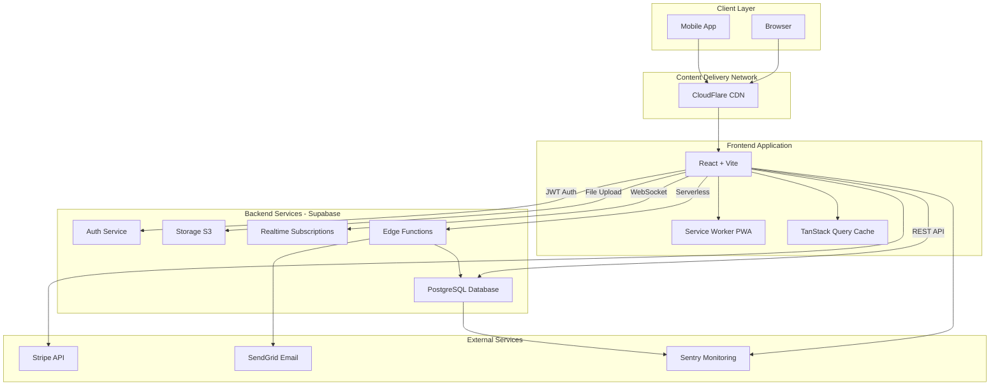

---

## System Components

### Frontend Components

#### React Application

- **Framework:** React 18 with TypeScript
- **Build Tool:** Vite (fast HMR, optimized production builds)
- **State Management:**
  - TanStack Query for server state
  - React Context for UI state
  - Local storage for persistence
- **Routing:** React Router v6
- **UI Library:** shadcn/ui + Tailwind CSS
- **Forms:** React Hook Form + Zod validation

#### Service Worker (PWA)

- Offline-first capabilities
- Background sync for failed requests
- Push notification support
- Asset caching strategy

### Backend Components

#### Supabase PostgreSQL

- **Database:** PostgreSQL 15
- **Features:**
  - Row-Level Security (RLS) policies
  - Full-text search with `ts_vector`
  - JSON/JSONB support
  - Triggers and functions
- **Extensions:**
  - `uuid-ossp` for UUID generation
  - `pg_trgm` for fuzzy search
  - `pgcrypto` for encryption

#### Authentication Service

- **Provider:** Supabase Auth
- **Features:**
  - Email/password authentication
  - OAuth 2.0 (Google, GitHub)
  - Magic link authentication
  - Multi-factor authentication (MFA)
  - Session management with JWT
- **Token Types:**
  - Access token (short-lived, 1 hour)
  - Refresh token (long-lived, 30 days)

#### Storage Service

- **Provider:** Supabase Storage (S3-compatible)
- **Buckets:**
  - `avatars` - User profile images
  - `attachments` - Project files
  - `documents` - Legal documents
- **Security:**
  - RLS policies on buckets
  - Signed URLs for private files
  - File type validation
  - Size limits enforced

#### Realtime Service

- **Technology:** WebSocket connections
- **Use Cases:**
  - Live notifications
  - Chat messages
  - Collaborative editing
  - Assignment status updates
- **Channels:**
  - User-specific channels
  - Assignment-specific channels
  - Global announcement channel

---

## Data Flow Diagrams

### User Authentication Flow

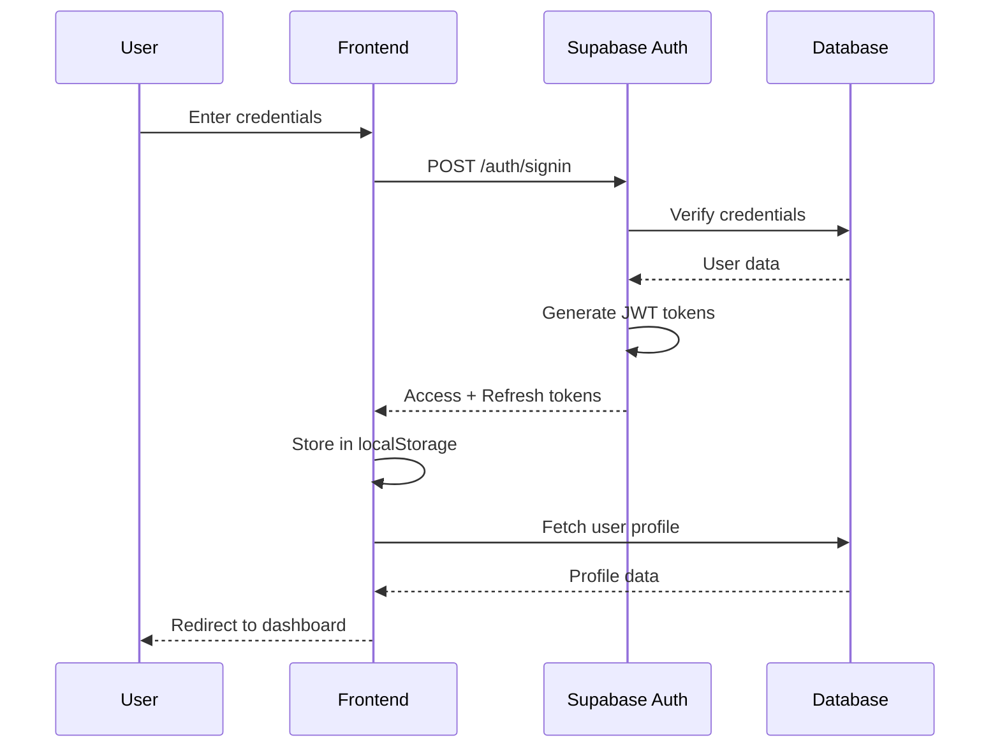

### Assignment Creation Flow

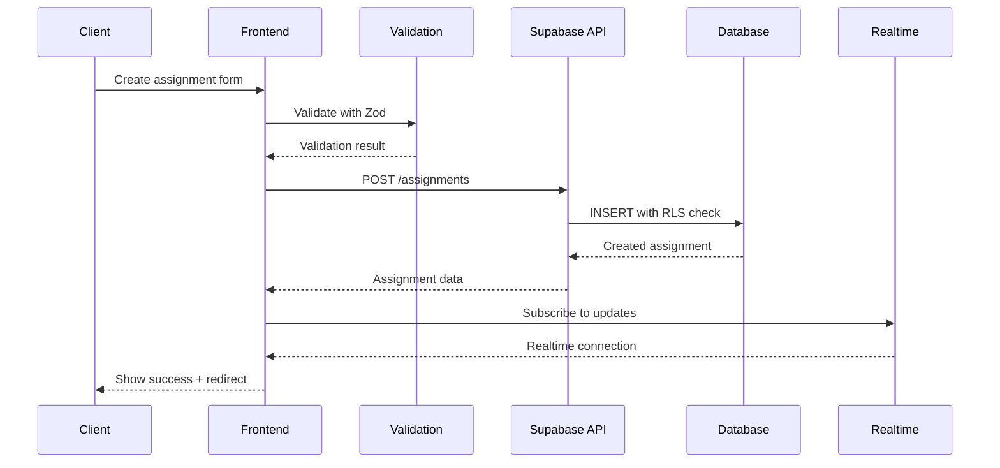

### Payment Processing Flow

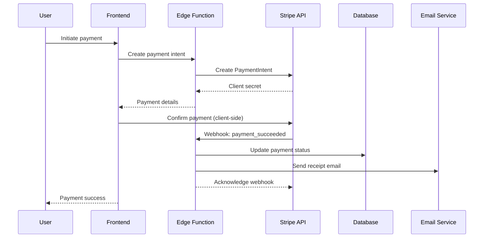

---

## Sequence Diagrams

### Sign-In Flow

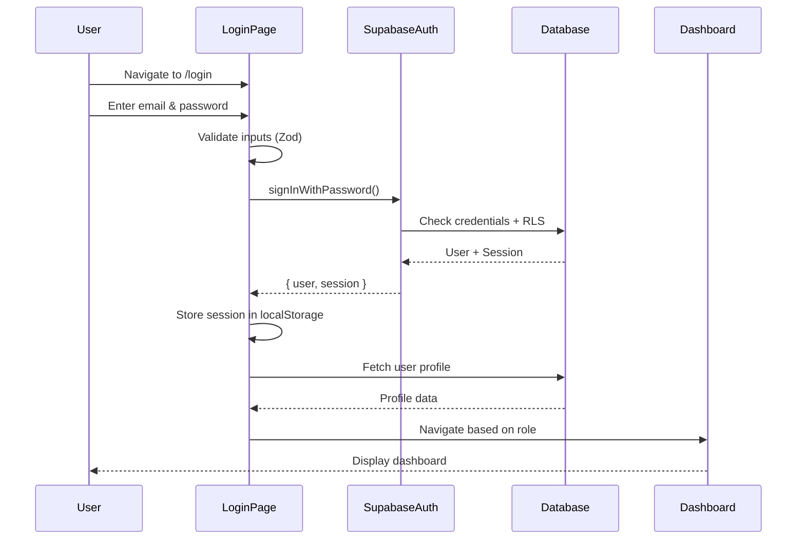

### Assignment Submission Flow

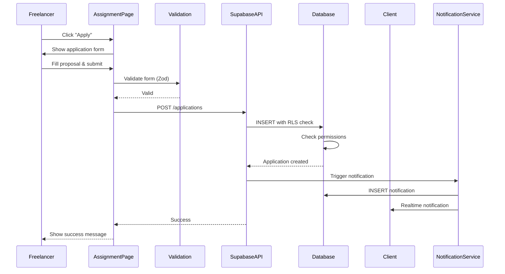

### OAuth Login Flow

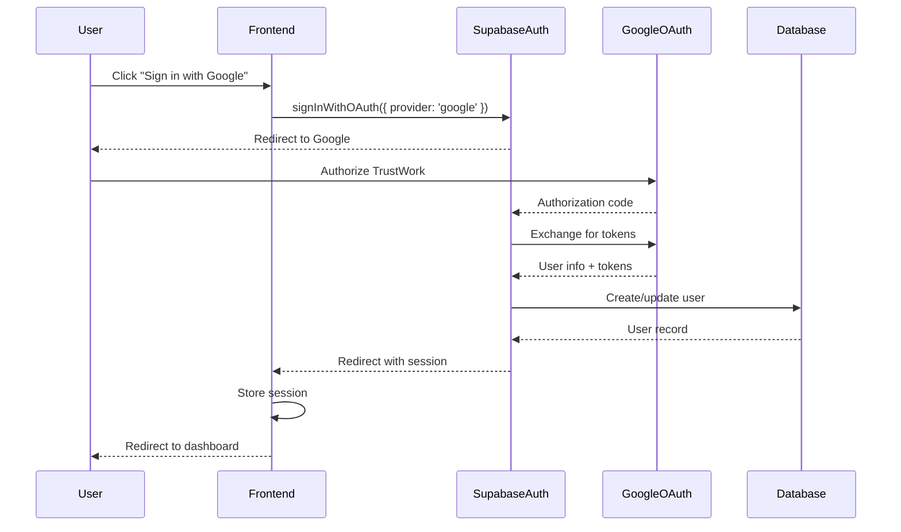

---

## Database Schema

### Entity Relationship Diagram

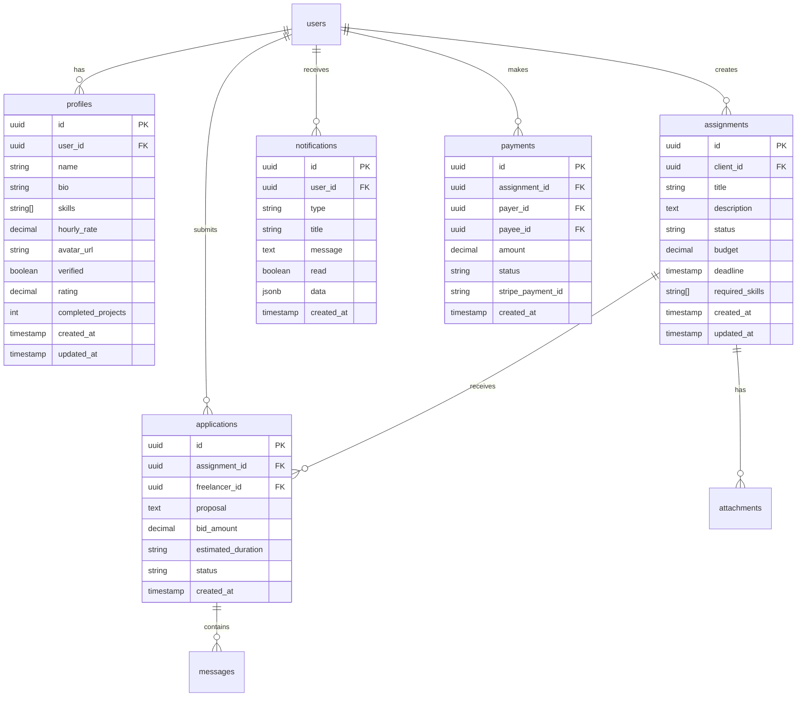

### Key Tables

For detailed schema, see [DATABASE.md](./DATABASE.md)

---

## Deployment Architecture

### Environment Separation

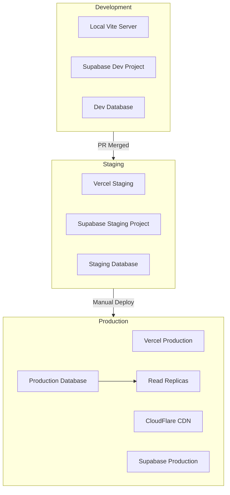

### CI/CD Pipeline

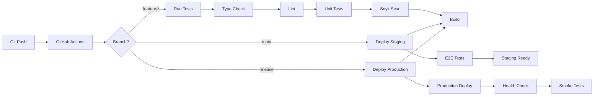

### Infrastructure

- **Frontend Hosting:** Vercel (automatic deployments from Git)
- **CDN:** CloudFlare (global edge network)
- **Backend:** Supabase (managed PostgreSQL + services)
- **Monitoring:** Sentry (error tracking) + LogRocket (session replay)
- **Analytics:** Google Analytics 4 + Supabase Analytics

---

## Security Architecture

### Security Layers

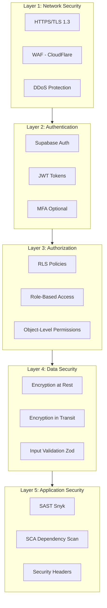

### Data Protection

- **At Rest:** AES-256 encryption (Supabase default)
- **In Transit:** TLS 1.3 for all connections
- **Secrets:** Environment variables, never in code
- **PII:** Encrypted columns for sensitive data
- **Backups:** Daily automated backups, encrypted

---

## Scalability Considerations

### Current Capacity

- **Users:** Designed for 100K+ concurrent users
- **Database:** PostgreSQL with connection pooling
- **Storage:** Unlimited (S3-compatible)
- **Realtime:** 500 concurrent connections per channel

### Scaling Strategies

#### Horizontal Scaling

- Frontend: Automatically scaled by Vercel
- Database: Read replicas for queries
- Storage: CDN for static assets

#### Vertical Scaling

- Database: Upgrade Supabase plan for more resources
- Edge Functions: Serverless auto-scaling

#### Caching Strategy

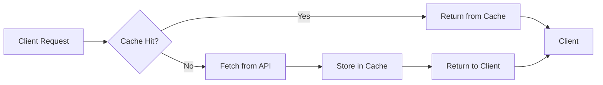

**Cache Layers:**

1. **Browser Cache:** Static assets (24 hours)
2. **CDN Cache:** Images, fonts (7 days)
3. **TanStack Query Cache:** API responses (5 minutes)
4. **Database Query Cache:** Expensive queries (1 minute)

### Performance Optimization

- **Code Splitting:** Lazy-load routes
- **Image Optimization:** WebP format, lazy loading
- **Bundle Size:** Target < 200KB initial load
- **API Optimization:** GraphQL for complex queries (future)
- **Database Indexing:** All foreign keys and query columns

---

## Third-Party Integrations

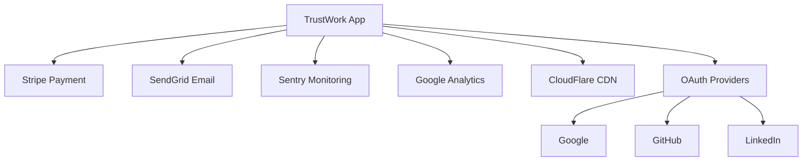

### Integration Details

| Service | Purpose | API Type | Auth Method |
|---------|---------|----------|-------------|
| Stripe | Payment processing | REST | API Key |
| SendGrid | Transactional emails | REST | API Key |
| Sentry | Error tracking | SDK | DSN |
| Google Analytics | User analytics | SDK | Measurement ID |
| CloudFlare | CDN + Security | DNS | API Token |
| OAuth Providers | Social login | OAuth 2.0 | Client ID/Secret |

---

## Disaster Recovery

### Backup Strategy

- **Database:** Daily full backups, 30-day retention
- **Point-in-Time Recovery:** Last 7 days
- **Storage:** S3 versioning enabled
- **Code:** Git repository (GitHub)

### Recovery Procedures

**RTO (Recovery Time Objective):** 4 hours  
**RPO (Recovery Point Objective):** 1 hour

See [DEPLOYMENT.md](./DEPLOYMENT.md) for detailed recovery procedures.

---

## References

- [API Documentation](./API.md)
- [Database Schema](./DATABASE.md)
- [Security Policy](./SECURITY.md)
- [Deployment Guide](./DEPLOYMENT.md)
- [Supabase Architecture](https://supabase.com/docs/guides/platform/architecture)

---

**Document Version:** 2.0  
**Last Updated:** November 3, 2025  
**Maintained By:** TrustWork Engineering Team

_This architecture is designed for scalability, security, and developer productivity._
