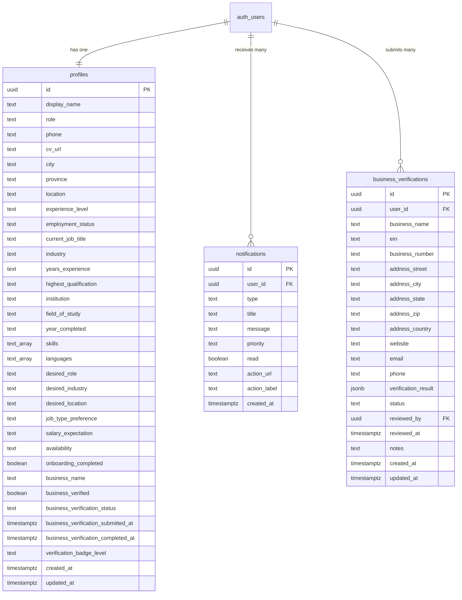

# TrustWork Database Documentation

**Database:** PostgreSQL 15 (via Supabase)  
**Schema Version:** 1.2.0  
**Last Updated:** November 3, 2025  
**Maintained By:** TrustWork Engineering Team

---

## Table of Contents

1. [Overview](#overview)
2. [Database Schema](#database-schema)
3. [Table Definitions](#table-definitions)
4. [Row-Level Security (RLS) Policies](#row-level-security-rls-policies)
5. [Indexes & Performance](#indexes--performance)
6. [Migrations](#migrations)
7. [Seeding Data](#seeding-data)
8. [Backup & Recovery](#backup--recovery)
9. [Best Practices](#best-practices)

---

## Overview

### Database Technology

- **Provider:** Supabase (managed PostgreSQL)
- **Version:** PostgreSQL 15.x
- **Extensions:**
  - `uuid-ossp` - UUID generation
  - `pg_trgm` - Fuzzy text search
  - `pgcrypto` - Encryption functions
- **Location:** US East (default)
- **Backup Schedule:** Daily automated backups, 7-day retention

### Connection Details

```typescript
// Never commit credentials; use environment variables
const supabaseUrl = import.meta.env.VITE_SUPABASE_URL;
const supabaseAnonKey = import.meta.env.VITE_SUPABASE_ANON_KEY;

// Client initialized in src/lib/supabaseClient.ts
import { supabase } from '@/lib/supabaseClient';
```

---

## Database Schema

### Entity Relationship Diagram



### Schema File

The complete schema is defined in `supabase/schema.sql`. To apply:

```bash
# Via Supabase CLI
supabase db push

# Or manually in Supabase SQL Editor
# Copy contents of supabase/schema.sql and execute
```

---

## Table Definitions

### `public.profiles`

User profile information for both job seekers and employers.

**Columns:**

| Column | Type | Nullable | Default | Description |
|--------|------|----------|---------|-------------|
| `id` | `uuid` | NO | - | Primary key, references `auth.users.id` |
| `display_name` | `text` | YES | - | User's display name |
| `role` | `text` | NO | `'job_seeker'` | User role: `job_seeker` or `employer` |
| `phone` | `text` | YES | - | Contact phone number |
| `cv_url` | `text` | YES | - | URL to uploaded CV/resume in Supabase Storage |
| `city` | `text` | YES | - | User's city |
| `province` | `text` | YES | - | User's province/state |
| `location` | `text` | YES | - | Full location string |
| `experience_level` | `text` | YES | - | Entry/Mid/Senior/Executive |
| `employment_status` | `text` | YES | - | Employed/Unemployed/Seeking |
| `current_job_title` | `text` | YES | - | Current or most recent job title |
| `industry` | `text` | YES | - | Industry sector |
| `years_experience` | `text` | YES | - | Total years of experience |
| `highest_qualification` | `text` | YES | - | Degree/certification level |
| `institution` | `text` | YES | - | Educational institution |
| `field_of_study` | `text` | YES | - | Major/field |
| `year_completed` | `text` | YES | - | Graduation year |
| `skills` | `text[]` | YES | - | Array of skill names |
| `languages` | `text[]` | YES | - | Array of languages |
| `desired_role` | `text` | YES | - | Target job title |
| `desired_industry` | `text` | YES | - | Target industry |
| `desired_location` | `text` | YES | - | Preferred work location |
| `job_type_preference` | `text` | YES | - | Full-time/Part-time/Contract |
| `salary_expectation` | `text` | YES | - | Expected salary range |
| `availability` | `text` | YES | - | Start date availability |
| `onboarding_completed` | `boolean` | NO | `false` | Whether user completed onboarding |
| `business_name` | `text` | YES | - | Employer's business name |
| `business_verified` | `boolean` | NO | `false` | Whether business is verified |
| `business_verification_status` | `text` | NO | `'not_started'` | Verification status |
| `business_verification_submitted_at` | `timestamptz` | YES | - | Submission timestamp |
| `business_verification_completed_at` | `timestamptz` | YES | - | Completion timestamp |
| `verification_badge_level` | `text` | NO | `'none'` | Badge level: none/basic/premium/enterprise |
| `created_at` | `timestamptz` | NO | `now()` | Record creation timestamp |
| `updated_at` | `timestamptz` | NO | `now()` | Last update timestamp |

**Constraints:**

- `role` must be `'job_seeker'` or `'employer'`
- `business_verification_status` must be `'not_started'`, `'pending'`, `'verified'`, or `'rejected'`
- `verification_badge_level` must be `'none'`, `'basic'`, `'premium'`, or `'enterprise'`

**Trigger:**

- `set_profiles_updated_at` - Automatically updates `updated_at` on row modification

**Example Query:**

```sql
-- Get profile for current user
SELECT * FROM profiles WHERE id = auth.uid();

-- Update user profile
UPDATE profiles
SET 
    display_name = 'John Doe',
    skills = ARRAY['JavaScript', 'React', 'TypeScript'],
    updated_at = NOW()
WHERE id = auth.uid();
```

---

### `public.notifications`

User notifications for job matches, applications, messages, payments, and system alerts.

**Columns:**

| Column | Type | Nullable | Default | Description |
|--------|------|----------|---------|-------------|
| `id` | `uuid` | NO | `gen_random_uuid()` | Primary key |
| `user_id` | `uuid` | NO | - | References `auth.users.id` |
| `type` | `text` | NO | - | Notification type |
| `title` | `text` | NO | - | Notification title |
| `message` | `text` | NO | - | Notification message body |
| `priority` | `text` | NO | `'low'` | Priority: low/medium/high |
| `read` | `boolean` | NO | `false` | Whether notification has been read |
| `action_url` | `text` | YES | - | Optional URL for action button |
| `action_label` | `text` | YES | - | Optional label for action button |
| `created_at` | `timestamptz` | NO | `now()` | Timestamp |

**Constraints:**

- `type` must be `'job_match'`, `'application'`, `'message'`, `'payment'`, `'safety'`, or `'system'`
- `priority` must be `'low'`, `'medium'`, or `'high'`

**Indexes:**

- `notifications_user_id_created_at_idx` on `(user_id, created_at DESC)` - Optimizes user notification queries

**Example Query:**

```sql
-- Get unread notifications for current user
SELECT * FROM notifications
WHERE user_id = auth.uid() AND read = false
ORDER BY created_at DESC;

-- Mark notification as read
UPDATE notifications
SET read = true
WHERE id = 'notification-uuid' AND user_id = auth.uid();
```

---

### `public.business_verifications`

Full business verification data for employers.

**Columns:**

| Column | Type | Nullable | Default | Description |
|--------|------|----------|---------|-------------|
| `id` | `uuid` | NO | `gen_random_uuid()` | Primary key |
| `user_id` | `uuid` | NO | - | References `auth.users.id` |
| `business_name` | `text` | NO | - | Legal business name |
| `ein` | `text` | YES | - | Employer Identification Number (US) |
| `business_number` | `text` | YES | - | Business registration number (non-US) |
| `address_street` | `text` | NO | - | Street address |
| `address_city` | `text` | NO | - | City |
| `address_state` | `text` | NO | - | State/province |
| `address_zip` | `text` | NO | - | Postal code |
| `address_country` | `text` | NO | `'US'` | Country code |
| `website` | `text` | YES | - | Business website |
| `email` | `text` | YES | - | Business email |
| `phone` | `text` | YES | - | Business phone |
| `verification_result` | `jsonb` | YES | - | External verification API response |
| `status` | `text` | NO | `'pending'` | Status: pending/approved/rejected |
| `reviewed_by` | `uuid` | YES | - | Admin user who reviewed |
| `reviewed_at` | `timestamptz` | YES | - | Review timestamp |
| `notes` | `text` | YES | - | Admin notes |
| `created_at` | `timestamptz` | NO | `now()` | Submission timestamp |
| `updated_at` | `timestamptz` | NO | `now()` | Last update timestamp |

**Constraints:**

- `status` must be `'pending'`, `'approved'`, or `'rejected'`

**Indexes:**

- `business_verifications_user_id_idx` on `user_id`
- `business_verifications_status_idx` on `status`

**Example Query:**

```sql
-- Get pending verifications (admin only)
SELECT * FROM business_verifications
WHERE status = 'pending'
ORDER BY created_at ASC;

-- Get user's verification status
SELECT * FROM business_verifications
WHERE user_id = auth.uid()
ORDER BY created_at DESC
LIMIT 1;
```

---

## Row-Level Security (RLS) Policies

All tables have RLS enabled. Policies enforce access control at the database level.

### `profiles` Policies

| Policy Name | Operation | Rule |
|-------------|-----------|------|
| `Profiles select own` | SELECT | `auth.uid() = id` |
| `Profiles insert self` | INSERT | `auth.uid() = id` |
| `Profiles update own` | UPDATE | `auth.uid() = id` |

**Meaning:** Users can only read, insert, and update their own profile.

### `notifications` Policies

| Policy Name | Operation | Rule |
|-------------|-----------|------|
| `Notifications select own` | SELECT | `auth.uid() = user_id` |
| `Notifications insert own` | INSERT | `auth.uid() = user_id` |
| `Notifications update own` | UPDATE | `auth.uid() = user_id` |
| `Notifications delete own` | DELETE | `auth.uid() = user_id` |

**Meaning:** Users can only access their own notifications.

### `business_verifications` Policies

| Policy Name | Operation | Rule |
|-------------|-----------|------|
| `Business verifications select own` | SELECT | `auth.uid() = user_id` |
| `Business verifications insert own` | INSERT | `auth.uid() = user_id` |

**Meaning:** Users can only view and create their own verification requests.

### Testing RLS Policies

```sql
-- Test as authenticated user
SET request.jwt.claims = '{"sub": "user-uuid-here"}';

-- Should return only user's profile
SELECT * FROM profiles WHERE id = 'user-uuid-here';

-- Should return empty (accessing another user's data)
SELECT * FROM profiles WHERE id = 'different-user-uuid';
```

---

## Indexes & Performance

### Existing Indexes

- `notifications_user_id_created_at_idx` - Optimizes notification queries by user and date
- `business_verifications_user_id_idx` - Speeds up verification lookups by user
- `business_verifications_status_idx` - Optimizes admin queries for pending verifications

### Query Performance Tips

1. **Always use indexes in WHERE clauses:**

   ```sql
   -- Good: Uses index
   SELECT * FROM notifications WHERE user_id = '...' ORDER BY created_at DESC;
   
   -- Bad: Full table scan
   SELECT * FROM notifications WHERE message LIKE '%urgent%';
   ```

2. **Use EXPLAIN ANALYZE to debug slow queries:**

   ```sql
   EXPLAIN ANALYZE
   SELECT * FROM profiles WHERE skills @> ARRAY['React'];
   ```

3. **Limit result sets:**

   ```sql
   -- Pagination
   SELECT * FROM notifications
   WHERE user_id = auth.uid()
   ORDER BY created_at DESC
   LIMIT 20 OFFSET 0;
   ```

---

## Migrations

### Running Migrations

**Option 1: Supabase CLI**

```bash
# Apply schema.sql
supabase db push

# Create new migration
supabase migration new add_assignments_table
```

**Option 2: Manual (Supabase Dashboard)**

1. Go to SQL Editor in Supabase Dashboard
2. Paste contents of `supabase/schema.sql`
3. Run query

### Migration Best Practices

- ✅ Always use `CREATE TABLE IF NOT EXISTS`
- ✅ Always use `ALTER TABLE ADD COLUMN IF NOT EXISTS`
- ✅ Test migrations on staging environment first
- ✅ Include rollback script for destructive changes
- ✅ Document breaking changes in `CHANGELOG.md`

### Example Migration

```sql
-- Migration: Add assignments table
-- Date: 2025-11-04
-- Author: Engineering Team

CREATE TABLE IF NOT EXISTS public.assignments (
    id uuid PRIMARY KEY DEFAULT gen_random_uuid(),
    client_id uuid NOT NULL REFERENCES auth.users(id) ON DELETE CASCADE,
    title text NOT NULL,
    description text NOT NULL,
    budget decimal(10, 2),
    deadline timestamptz,
    status text CHECK (status IN ('open', 'in_progress', 'completed', 'cancelled')) NOT NULL DEFAULT 'open',
    created_at timestamptz NOT NULL DEFAULT now(),
    updated_at timestamptz NOT NULL DEFAULT now()
);

-- RLS policies
ALTER TABLE public.assignments ENABLE ROW LEVEL SECURITY;

CREATE POLICY "Assignments select all" ON public.assignments
    FOR SELECT USING (true);

CREATE POLICY "Assignments insert own" ON public.assignments
    FOR INSERT WITH CHECK (auth.uid() = client_id);

CREATE POLICY "Assignments update own" ON public.assignments
    FOR UPDATE USING (auth.uid() = client_id);
```

---

## Seeding Data

### Seed Script

Create `supabase/seed.sql`:

```sql
-- Seed data for development/testing
-- WARNING: DO NOT run this in production!

-- Create test profiles
INSERT INTO public.profiles (id, display_name, role, skills)
VALUES
    ('test-user-1', 'Alice Johnson', 'job_seeker', ARRAY['React', 'TypeScript']),
    ('test-user-2', 'Bob Smith', 'employer', ARRAY['Management', 'HR'])
ON CONFLICT (id) DO NOTHING;

-- Create test notifications
INSERT INTO public.notifications (user_id, type, title, message, priority)
VALUES
    ('test-user-1', 'job_match', 'New Job Match', 'A new job matches your profile!', 'high'),
    ('test-user-1', 'system', 'Welcome', 'Welcome to TrustWork!', 'low')
ON CONFLICT DO NOTHING;
```

### Running Seed Script

```bash
# Via Supabase CLI
supabase db seed

# Or manually in SQL Editor
# Copy contents of supabase/seed.sql and execute
```

---

## Backup & Recovery

### Automated Backups

- **Frequency:** Daily
- **Retention:** 7 days (Free tier), 30 days (Pro tier)
- **Scope:** Full database (schema + data)

### Manual Backup

```bash
# Export via Supabase CLI
supabase db dump > backup_$(date +%Y%m%d).sql

# Restore from backup
psql -h db.xxx.supabase.co -U postgres -d postgres < backup.sql
```

### Point-in-Time Recovery (PITR)

Available on Pro plan and above:

- Recovery window: Last 7 days
- Granularity: Down to the second

### Disaster Recovery Plan

1. **Daily Backups:** Automated by Supabase
2. **Offsite Storage:** Download critical backups to S3/Google Cloud Storage weekly
3. **RTO (Recovery Time Objective):** 4 hours
4. **RPO (Recovery Point Objective):** 1 hour (via PITR on Pro plan)

---

## Best Practices

### Security

- ✅ **Always use RLS policies** - Never rely on client-side checks
- ✅ **Test RLS policies thoroughly** - Use `SET request.jwt.claims` for testing
- ✅ **Never expose service_role key** - Use anon key on client
- ✅ **Validate input with Zod** - Validate on client AND server (Edge Functions)
- ✅ **Use parameterized queries** - Prevent SQL injection

### Performance

- ✅ **Create indexes for frequent queries** - Especially on foreign keys
- ✅ **Use pagination for large result sets** - Avoid fetching thousands of rows
- ✅ **Use `SELECT` specific columns** - Avoid `SELECT *` in production
- ✅ **Cache expensive queries** - Use TanStack Query for client-side caching
- ✅ **Monitor slow queries** - Use Supabase Dashboard query analyzer

### Data Integrity

- ✅ **Use foreign key constraints** - Enforce referential integrity
- ✅ **Use check constraints** - Validate enum values at database level
- ✅ **Use triggers for computed fields** - e.g., `updated_at` timestamp
- ✅ **Use transactions for multi-step operations** - Ensure atomicity

### Development

- ✅ **Use TypeScript types** - Generate types from schema: `supabase gen types typescript`
- ✅ **Version control schema** - Keep `schema.sql` in Git
- ✅ **Document breaking changes** - Update `CHANGELOG.md`
- ✅ **Test migrations locally** - Use Supabase local development

---

## References

- [Supabase Database Docs](https://supabase.com/docs/guides/database)
- [PostgreSQL Documentation](https://www.postgresql.org/docs/15/)
- [Row-Level Security Guide](https://supabase.com/docs/guides/auth/row-level-security)
- [API Documentation](./API.md)
- [Architecture Documentation](./ARCHITECTURE.md)

---

**Document Version:** 1.0  
**Last Updated:** November 3, 2025  
**Maintained By:** TrustWork Engineering Team

_For schema changes, create a migration and update this document accordingly._
