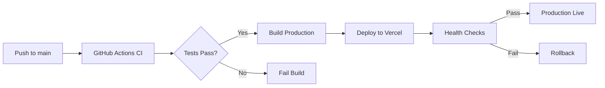

# TrustWork Deployment Guide

**Version:** 1.0  
**Last Updated:** November 3, 2025  
**Maintained By:** TrustWork DevOps Team

---

## Table of Contents

1. [Overview](#overview)
2. [Deployment Environments](#deployment-environments)
3. [Prerequisites](#prerequisites)
4. [Build Process](#build-process)
5. [Deployment Platforms](#deployment-platforms)
6. [CI/CD Pipeline](#cicd-pipeline)
7. [Environment Variables](#environment-variables)
8. [Database Migrations](#database-migrations)
9. [Monitoring & Alerts](#monitoring--alerts)
10. [Rollback Procedures](#rollback-procedures)
11. [Security Checklist](#security-checklist)
12. [Troubleshooting](#troubleshooting)

---

## Overview

TrustWork uses a **continuous deployment** strategy with automated pipelines for staging and production environments. The application is a static React SPA (Single Page Application) deployed to edge networks for optimal performance.

### Deployment Strategy



### Key Principles

- **Zero Downtime**: Rolling deployments with health checks
- **Automated Testing**: All deployments run full test suite
- **Immutable Builds**: Each deployment creates a new immutable artifact
- **Easy Rollback**: Previous versions retained for quick rollback
- **Security First**: Security scans before every deployment

---

## Deployment Environments

### Environment Strategy

| Environment | Branch | URL | Purpose | Auto-Deploy |
|-------------|--------|-----|---------|-------------|
| **Development** | `feature/*` | `localhost:8080` | Local development | No |
| **Staging** | `working-version` | `staging.trustwork.com` | Pre-production testing | Yes |
| **Production** | `main` | `trustwork.com` | Live users | Manual approval |

### Environment Characteristics

#### Development

- Local Supabase project (optional)
- Hot Module Replacement (HMR)
- Debug logging enabled
- No analytics tracking

#### Staging

- Mirrors production configuration
- Separate Supabase project
- Used for QA and stakeholder review
- Automated deployment on merge

#### Production

- Optimized build with minification
- Global CDN distribution
- Real user monitoring
- Manual deployment approval required

---

## Prerequisites

### Required Accounts

- **GitHub Account**: Source code repository
- **Vercel Account**: Hosting platform (recommended)
- **Supabase Account**: Backend services
- **Sentry Account** (optional): Error tracking
- **LogRocket Account** (optional): Session replay

### Required Tools

```bash
# Install Vercel CLI
npm install -g vercel

# Install Supabase CLI (optional)
npm install -g supabase

# Verify installations
vercel --version
node --version
npm --version
```

### Access Requirements

- **GitHub**: Write access to repository
- **Vercel**: Deployment permissions
- **Supabase**: Admin access to project
- **Domain DNS**: Access to configure DNS records (for custom domain)

---

## Build Process

### Local Build

```bash
# Create production build
npm run build

# Output: dist/ directory
# - Minified JavaScript
# - Optimized CSS
# - Code-split bundles
# - Static assets
```

### Build Configuration

**File:** `vite.config.ts`

```typescript
import { defineConfig } from 'vite';
import react from '@vitejs/plugin-react-swc';
import path from 'path';

export default defineConfig({
  plugins: [react()],
  resolve: {
    alias: {
      '@': path.resolve(__dirname, './src'),
    },
  },
  build: {
    outDir: 'dist',
    sourcemap: false, // Enable for staging
    minify: 'esbuild',
    target: 'es2015',
    chunkSizeWarningLimit: 600,
    rollupOptions: {
      output: {
        manualChunks: {
          'react-vendor': ['react', 'react-dom', 'react-router-dom'],
          'ui-vendor': ['@radix-ui/react-dialog', '@radix-ui/react-dropdown-menu'],
          'supabase-vendor': ['@supabase/supabase-js'],
        },
      },
    },
  },
  server: {
    port: 8080,
  },
});
```

### Build Verification

```bash
# Build and preview locally
npm run build
npm run preview

# Open http://localhost:4173
# Verify:
# - All routes work
# - No console errors
# - Assets load correctly
# - Authentication works
```

---

## Deployment Platforms

### Vercel (Recommended)

Vercel provides automatic deployments, global CDN, and serverless functions.

#### Initial Setup

1. **Connect GitHub repository:**

   ```bash
   # Login to Vercel
   vercel login

   # Link project
   cd trust-work
   vercel link
   ```

2. **Configure project:**
   - Framework: Vite
   - Build Command: `npm run build`
   - Output Directory: `dist`
   - Install Command: `npm install`

3. **Set environment variables:**
   - Go to Vercel Dashboard → Settings → Environment Variables
   - Add:
     - `VITE_SUPABASE_URL`
     - `VITE_SUPABASE_ANON_KEY`
   - Set for: Production, Preview, Development

4. **Deploy:**

   ```bash
   # Deploy to production
   vercel --prod

   # Or push to main branch (auto-deploy)
   git push origin main
   ```

#### Vercel Configuration

**File:** `vercel.json`

```json
{
  "framework": "vite",
  "buildCommand": "npm run build",
  "outputDirectory": "dist",
  "devCommand": "npm run dev",
  "installCommand": "npm install",
  "rewrites": [
    {
      "source": "/(.*)",
      "destination": "/index.html"
    }
  ],
  "headers": [
    {
      "source": "/(.*)",
      "headers": [
        {
          "key": "X-Content-Type-Options",
          "value": "nosniff"
        },
        {
          "key": "X-Frame-Options",
          "value": "DENY"
        },
        {
          "key": "X-XSS-Protection",
          "value": "1; mode=block"
        },
        {
          "key": "Referrer-Policy",
          "value": "strict-origin-when-cross-origin"
        }
      ]
    }
  ]
}
```

### Netlify (Alternative)

#### Setup

1. **Connect repository:**
   - Go to Netlify Dashboard
   - Click "Add new site" → "Import an existing project"
   - Select GitHub repository

2. **Build settings:**
   - Build command: `npm run build`
   - Publish directory: `dist`
   - Base directory: (leave empty)

3. **Environment variables:**
   - Add same variables as Vercel

4. **Configure redirects:**

**File:** `public/_redirects`

```
/*    /index.html   200
```

### GitHub Pages (Not Recommended)

GitHub Pages has limitations for SPAs. Use Vercel or Netlify instead.

---

## CI/CD Pipeline

### GitHub Actions Workflow

**File:** `.github/workflows/deploy.yml`

```yaml
name: Deploy to Production

on:
  push:
    branches:
      - main
  workflow_dispatch:

jobs:
  test:
    runs-on: ubuntu-latest
    steps:
      - uses: actions/checkout@v3
      
      - uses: actions/setup-node@v3
        with:
          node-version: 18
          cache: 'npm'
      
      - name: Install dependencies
        run: npm ci
      
      - name: Type check
        run: npm run type-check
      
      - name: Lint
        run: npm run lint
      
      - name: Run tests
        run: npm test -- --coverage
      
      - name: Upload coverage
        uses: codecov/codecov-action@v3

  security:
    runs-on: ubuntu-latest
    needs: test
    steps:
      - uses: actions/checkout@v3
      
      - name: Run Snyk security scan
        uses: snyk/actions/node@master
        env:
          SNYK_TOKEN: ${{ secrets.SNYK_TOKEN }}
        with:
          args: --severity-threshold=high

  build:
    runs-on: ubuntu-latest
    needs: [test, security]
    steps:
      - uses: actions/checkout@v3
      
      - uses: actions/setup-node@v3
        with:
          node-version: 18
          cache: 'npm'
      
      - name: Install dependencies
        run: npm ci
      
      - name: Build
        run: npm run build
        env:
          VITE_SUPABASE_URL: ${{ secrets.VITE_SUPABASE_URL }}
          VITE_SUPABASE_ANON_KEY: ${{ secrets.VITE_SUPABASE_ANON_KEY }}
      
      - name: Upload build artifacts
        uses: actions/upload-artifact@v3
        with:
          name: dist
          path: dist/

  deploy:
    runs-on: ubuntu-latest
    needs: build
    environment:
      name: production
      url: https://trustwork.com
    steps:
      - uses: actions/checkout@v3
      
      - name: Download build artifacts
        uses: actions/download-artifact@v3
        with:
          name: dist
          path: dist
      
      - name: Deploy to Vercel
        uses: amondnet/vercel-action@v25
        with:
          vercel-token: ${{ secrets.VERCEL_TOKEN }}
          vercel-org-id: ${{ secrets.VERCEL_ORG_ID }}
          vercel-project-id: ${{ secrets.VERCEL_PROJECT_ID }}
          vercel-args: '--prod'
      
      - name: Run smoke tests
        run: |
          npm install -g playwright
          npx playwright test --config=playwright-smoke.config.ts

  notify:
    runs-on: ubuntu-latest
    needs: deploy
    if: always()
    steps:
      - name: Send deployment notification
        run: |
          # Send notification to Slack/Discord/Email
          echo "Deployment ${{ job.status }}"
```

### Staging Workflow

**File:** `.github/workflows/staging.yml`

```yaml
name: Deploy to Staging

on:
  push:
    branches:
      - working-version

jobs:
  deploy-staging:
    runs-on: ubuntu-latest
    steps:
      # Similar to production, but deploy to staging environment
      - uses: actions/checkout@v3
      
      - uses: actions/setup-node@v3
        with:
          node-version: 18
      
      - run: npm ci
      - run: npm run build
      
      - name: Deploy to Vercel Staging
        uses: amondnet/vercel-action@v25
        with:
          vercel-token: ${{ secrets.VERCEL_TOKEN }}
          vercel-org-id: ${{ secrets.VERCEL_ORG_ID }}
          vercel-project-id: ${{ secrets.VERCEL_PROJECT_ID }}
          # No --prod flag = preview deployment
```

---

## Environment Variables

### Required Variables

| Variable | Environment | Description | Example |
|----------|------------|-------------|---------|
| `VITE_SUPABASE_URL` | All | Supabase project URL | `https://xxx.supabase.co` |
| `VITE_SUPABASE_ANON_KEY` | All | Supabase anon/public key | `eyJhbGc...` |

### Optional Variables

| Variable | Environment | Description | Example |
|----------|------------|-------------|---------|
| `VITE_SENTRY_DSN` | Production | Sentry error tracking DSN | `https://xxx@sentry.io/xxx` |
| `VITE_LOGROCKET_ID` | Production | LogRocket project ID | `abcdef/trustwork` |
| `VITE_GA_TRACKING_ID` | Production | Google Analytics ID | `G-XXXXXXXXXX` |

### Setting Variables

#### Vercel Dashboard

1. Go to Project Settings → Environment Variables
2. Add key-value pairs
3. Select environments (Production, Preview, Development)
4. Save and redeploy

#### GitHub Secrets

1. Go to Repository Settings → Secrets and variables → Actions
2. Click "New repository secret"
3. Add name and value
4. Use in workflows: `${{ secrets.SECRET_NAME }}`

#### Local Development

```bash
# .env file (not committed)
VITE_SUPABASE_URL=https://your-project.supabase.co
VITE_SUPABASE_ANON_KEY=your-anon-key
```

---

## Database Migrations

### Running Migrations in Production

1. **Backup database:**

   ```bash
   # Via Supabase Dashboard: Database → Backups → Create backup
   ```

2. **Test migration in staging:**
   - Run migration in staging Supabase project
   - Verify no data loss
   - Test application functionality

3. **Run in production:**
   - Go to Production Supabase Dashboard → SQL Editor
   - Paste migration SQL
   - Execute
   - Verify tables/columns created

4. **Verify application:**
   - Check frontend still works
   - Verify no errors in Sentry
   - Monitor for issues

### Migration Best Practices

- ✅ Always create backup before migration
- ✅ Test migrations in staging first
- ✅ Use `IF NOT EXISTS` for new tables
- ✅ Use `ADD COLUMN IF NOT EXISTS` for new columns
- ✅ Document migrations in `CHANGELOG.md`
- ✅ Include rollback script

### Example Migration with Rollback

```sql
-- Migration: Add assignments table
-- Date: 2025-11-04
-- Author: Engineering Team

-- FORWARD MIGRATION
CREATE TABLE IF NOT EXISTS public.assignments (
    id uuid PRIMARY KEY DEFAULT gen_random_uuid(),
    client_id uuid NOT NULL REFERENCES auth.users(id),
    title text NOT NULL,
    created_at timestamptz NOT NULL DEFAULT now()
);

ALTER TABLE public.assignments ENABLE ROW LEVEL SECURITY;

CREATE POLICY "Assignments select all" ON public.assignments
    FOR SELECT USING (true);

-- ROLLBACK SCRIPT (keep in separate file)
-- DROP TABLE IF EXISTS public.assignments CASCADE;
```

---

## Monitoring & Alerts

### Health Checks

#### Application Health Endpoint

```typescript
// src/pages/Health.tsx
export function Health() {
  const [health, setHealth] = useState({
    status: 'checking',
    database: 'unknown',
    timestamp: new Date().toISOString(),
  });

  useEffect(() => {
    const checkHealth = async () => {
      try {
        // Check Supabase connection
        const { data, error } = await supabase.from('profiles').select('id').limit(1);
        
        setHealth({
          status: error ? 'unhealthy' : 'healthy',
          database: error ? 'error' : 'connected',
          timestamp: new Date().toISOString(),
        });
      } catch (err) {
        setHealth({
          status: 'unhealthy',
          database: 'error',
          timestamp: new Date().toISOString(),
        });
      }
    };

    checkHealth();
  }, []);

  return <div>{JSON.stringify(health, null, 2)}</div>;
}
```

### Monitoring Tools

#### Sentry (Error Tracking)

```typescript
// src/main.tsx
import * as Sentry from '@sentry/react';

Sentry.init({
  dsn: import.meta.env.VITE_SENTRY_DSN,
  environment: import.meta.env.MODE,
  tracesSampleRate: 1.0,
  integrations: [
    new Sentry.BrowserTracing(),
    new Sentry.Replay(),
  ],
});
```

#### LogRocket (Session Replay)

```typescript
// src/main.tsx
import LogRocket from 'logrocket';

if (import.meta.env.PROD) {
  LogRocket.init(import.meta.env.VITE_LOGROCKET_ID);
}
```

### Alert Configuration

Set up alerts for:

- **Error Rate**: > 5% of requests fail
- **Response Time**: > 3 seconds average
- **Uptime**: < 99.9%
- **Build Failures**: Any deployment fails
- **Security Vulnerabilities**: High or critical severity

---

## Rollback Procedures

### Quick Rollback (Vercel)

1. **Via Vercel Dashboard:**
   - Go to Deployments
   - Find previous working deployment
   - Click "..." → "Promote to Production"

2. **Via CLI:**

   ```bash
   # List recent deployments
   vercel ls

   # Promote specific deployment
   vercel promote <deployment-url>
   ```

### Database Rollback

1. **Restore from backup:**
   - Go to Supabase Dashboard → Database → Backups
   - Select backup timestamp
   - Click "Restore"
   - Confirm (will replace current data)

2. **Run rollback script:**
   - Execute rollback SQL (if available)
   - Verify data integrity

### Full System Rollback

1. Rollback frontend (Vercel)
2. Rollback database (Supabase backup)
3. Verify system health
4. Notify team and users (if needed)

---

## Security Checklist

### Pre-Deployment Security Checks

- [ ] All secrets stored in environment variables, not in code
- [ ] Snyk scan passed with no high/critical vulnerabilities
- [ ] Dependency versions up to date
- [ ] No console.log statements with sensitive data
- [ ] RLS policies tested and verified
- [ ] HTTPS enforced for all connections
- [ ] Security headers configured (CSP, X-Frame-Options, etc.)
- [ ] CORS configured correctly
- [ ] Authentication tested (including edge cases)
- [ ] Input validation in place for all forms

### Post-Deployment Security Verification

- [ ] Verify HTTPS certificate is valid
- [ ] Check security headers: [securityheaders.com](https://securityheaders.com/)
- [ ] Run penetration test (if available)
- [ ] Verify RLS policies in production
- [ ] Check error messages don't leak sensitive info
- [ ] Monitor error logs for security issues

---

## Troubleshooting

### Deployment Failures

#### Build Fails with Type Errors

```bash
# Solution: Run type check locally
npm run type-check

# Fix errors, then commit and push
```

#### Environment Variables Not Found

```bash
# Solution: Verify variables are set in Vercel/Netlify
# Check spelling (case-sensitive)
# Ensure they start with VITE_
# Redeploy after adding variables
```

#### 404 on Refresh

```bash
# Solution: Add rewrite rule for SPA
# Vercel: Check vercel.json has rewrite rule
# Netlify: Add _redirects file
```

### Runtime Issues

#### White Screen After Deployment

```bash
# Check browser console for errors
# Verify assets are loading (Network tab)
# Check Supabase connection
# Verify environment variables are correct
```

#### Supabase Connection Fails

```bash
# Verify VITE_SUPABASE_URL and VITE_SUPABASE_ANON_KEY
# Check Supabase project is not paused
# Verify RLS policies allow access
# Check browser console for specific error
```

---

## References

- [Vercel Documentation](https://vercel.com/docs)
- [Supabase Production Checklist](https://supabase.com/docs/guides/platform/going-into-prod)
- [GitHub Actions Documentation](https://docs.github.com/en/actions)
- [Vite Build Guide](https://vitejs.dev/guide/build.html)

---

**Document Version:** 1.0  
**Last Updated:** November 3, 2025  
**Maintained By:** TrustWork DevOps Team

_Always test deployments in staging before production. Never deploy on Fridays._
