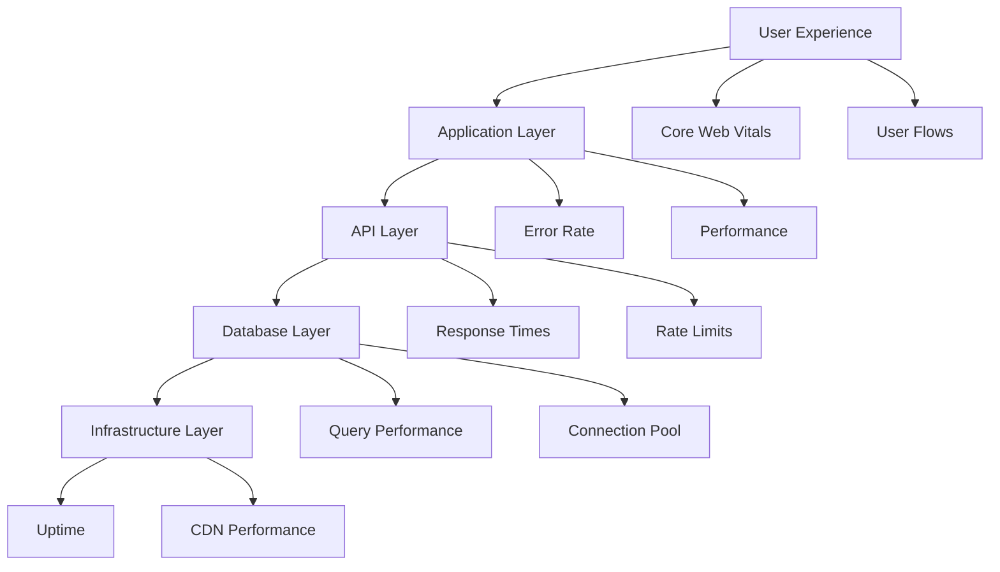

# TrustWork Monitoring Guide

**Version:** 1.0  
**Last Updated:** November 3, 2025  
**Maintained By:** TrustWork DevOps Team

---

## Table of Contents

1. [Overview](#overview)
2. [Monitoring Strategy](#monitoring-strategy)
3. [Application Performance Monitoring](#application-performance-monitoring)
4. [Error Tracking](#error-tracking)
5. [Database Monitoring](#database-monitoring)
6. [User Analytics](#user-analytics)
7. [Infrastructure Monitoring](#infrastructure-monitoring)
8. [Alerting & Notifications](#alerting--notifications)
9. [Dashboards](#dashboards)
10. [Incident Response](#incident-response)

---

## Overview

TrustWork uses a multi-layered monitoring approach to ensure application health, performance, and user satisfaction. This document covers tools, metrics, dashboards, and alerting strategies.

### Monitoring Goals

- **Availability**: Maintain 99.9% uptime
- **Performance**: Keep page load times <3 seconds
- **User Experience**: Track Core Web Vitals and user flows
- **Reliability**: Detect and respond to errors quickly
- **Security**: Monitor for suspicious activity

### Tools Stack

| Tool | Purpose | Environment |
|------|---------|-------------|
| **Sentry** | Error tracking and performance | Production, Staging |
| **LogRocket** | Session replay and debugging | Production |
| **Vercel Analytics** | Traffic and performance metrics | Production |
| **Supabase Dashboard** | Database and API monitoring | All |
| **Google Analytics 4** | User behavior and conversions | Production |
| **Uptime Robot** | Uptime monitoring | Production |

---

## Monitoring Strategy

### Monitoring Layers



### Key Metrics

#### Frontend Metrics

- **Largest Contentful Paint (LCP)**: <2.5s (good)
- **First Input Delay (FID)**: <100ms (good)
- **Cumulative Layout Shift (CLS)**: <0.1 (good)
- **Time to First Byte (TTFB)**: <600ms
- **Bundle Size**: <500KB initial load

#### Backend Metrics

- **API Response Time**: <200ms p95
- **Database Query Time**: <50ms p95
- **Error Rate**: <1% of requests
- **Uptime**: >99.9%

#### User Metrics

- **Session Duration**: Average 5+ minutes
- **Bounce Rate**: <40%
- **Conversion Rate**: Track key actions
- **User Satisfaction**: Monitor feedback

---

## Application Performance Monitoring

### Sentry Setup

#### Installation

```bash
npm install @sentry/react
```

#### Configuration

**File:** `src/lib/sentry.ts`

```typescript
import * as Sentry from '@sentry/react';
import { BrowserTracing } from '@sentry/tracing';
import { useEffect } from 'react';
import { useLocation, useNavigationType, createRoutesFromChildren, matchRoutes } from 'react-router-dom';

export function initSentry() {
  if (import.meta.env.PROD) {
    Sentry.init({
      dsn: import.meta.env.VITE_SENTRY_DSN,
      environment: import.meta.env.MODE,
      
      // Performance monitoring
      integrations: [
        new BrowserTracing({
          routingInstrumentation: Sentry.reactRouterV6Instrumentation(
            useEffect,
            useLocation,
            useNavigationType,
            createRoutesFromChildren,
            matchRoutes
          ),
        }),
        new Sentry.Replay({
          maskAllText: true,
          blockAllMedia: true,
        }),
      ],
      
      // Sample rates
      tracesSampleRate: 0.1, // 10% of transactions
      replaysSessionSampleRate: 0.1, // 10% of sessions
      replaysOnErrorSampleRate: 1.0, // 100% of sessions with errors
      
      // Filter out noise
      beforeSend(event) {
        // Don't send errors from development
        if (window.location.hostname === 'localhost') {
          return null;
        }
        
        // Filter out known non-critical errors
        if (event.exception?.values?.[0]?.value?.includes('ResizeObserver')) {
          return null;
        }
        
        return event;
      },
    });
  }
}
```

#### Usage in App

**File:** `src/main.tsx`

```typescript
import { initSentry } from '@/lib/sentry';

initSentry();

ReactDOM.createRoot(document.getElementById('root')!).render(
  <React.StrictMode>
    <SupabaseProvider>
      <BrowserRouter>
        <App />
      </BrowserRouter>
    </SupabaseProvider>
  </React.StrictMode>
);
```

#### Custom Error Boundaries

```typescript
import * as Sentry from '@sentry/react';

const SentryErrorBoundary = Sentry.ErrorBoundary;

function App() {
  return (
    <SentryErrorBoundary fallback={<ErrorFallback />} showDialog>
      <Router />
    </SentryErrorBoundary>
  );
}
```

### Performance Tracking

#### Measure Component Performance

```typescript
import * as Sentry from '@sentry/react';

function ExpensiveComponent() {
  useEffect(() => {
    const transaction = Sentry.startTransaction({
      name: 'ExpensiveComponent Render',
      op: 'component.render',
    });
    
    // Perform expensive operation
    const result = performExpensiveCalc();
    
    transaction.finish();
  }, []);
}
```

#### Track Custom Metrics

```typescript
import * as Sentry from '@sentry/react';

// Track API call duration
const startTime = Date.now();
const data = await fetchData();
const duration = Date.now() - startTime;

Sentry.metrics.distribution('api.call.duration', duration, {
  tags: { endpoint: '/api/profiles' },
});

// Track custom events
Sentry.metrics.increment('assignment.submitted', 1, {
  tags: { type: 'freelance' },
});
```

### Sentry Dashboard

#### Key Views

1. **Issues**: Grouped errors with stack traces
2. **Performance**: Transaction summaries and slow queries
3. **Releases**: Track errors by deployment
4. **Users**: Affected users and sessions

#### Alert Configuration

Go to Sentry Dashboard → Alerts → Create Alert Rule

**Example: High Error Rate Alert**

```yaml
Alert Name: High Error Rate
Condition: 
  - Errors > 100 in 5 minutes
  - Environment: production
Actions:
  - Send email to engineering@trustwork.com
  - Post to Slack #alerts channel
```

---

## Error Tracking

### LogRocket Setup

LogRocket provides session replay to reproduce bugs.

#### Installation

```bash
npm install logrocket logrocket-react
```

#### Configuration

**File:** `src/lib/logrocket.ts`

```typescript
import LogRocket from 'logrocket';
import setupLogRocketReact from 'logrocket-react';

export function initLogRocket() {
  if (import.meta.env.PROD) {
    LogRocket.init(import.meta.env.VITE_LOGROCKET_ID, {
      // Network capture
      network: {
        requestSanitizer: (request) => {
          // Sanitize sensitive headers
          if (request.headers['Authorization']) {
            request.headers['Authorization'] = '[REDACTED]';
          }
          return request;
        },
      },
      
      // Console capture
      console: {
        shouldAggregateConsoleErrors: true,
      },
      
      // DOM capture
      dom: {
        inputSanitizer: true, // Sanitize input values
      },
    });
    
    setupLogRocketReact(LogRocket);
  }
}
```

#### Identify Users

```typescript
import LogRocket from 'logrocket';

// After user logs in
LogRocket.identify(user.id, {
  name: user.full_name,
  email: user.email,
  role: user.role,
});
```

#### Integrate with Sentry

```typescript
import * as Sentry from '@sentry/react';
import LogRocket from 'logrocket';

LogRocket.getSessionURL((sessionURL) => {
  Sentry.configureScope((scope) => {
    scope.setExtra('sessionURL', sessionURL);
  });
});
```

### Error Categories

Track errors by category for better insights:

```typescript
// Validation errors
Sentry.captureException(error, {
  tags: { category: 'validation' },
  level: 'warning',
});

// API errors
Sentry.captureException(error, {
  tags: { 
    category: 'api',
    endpoint: '/api/profiles',
    status_code: response.status,
  },
  level: 'error',
});

// User errors
Sentry.captureException(error, {
  tags: { category: 'user_action' },
  level: 'info',
});
```

---

## Database Monitoring

### Supabase Dashboard

Access at: [https://app.supabase.com](https://app.supabase.com)

#### Key Metrics

1. **Database**:
   - Connection pool usage
   - Active queries
   - Query performance
   - Table sizes

2. **API**:
   - Requests per second
   - Response times
   - Error rates

3. **Storage**:
   - Upload/download bandwidth
   - Storage usage

4. **Auth**:
   - Login attempts
   - Active sessions
   - Failed authentications

### Query Performance Monitoring

#### Enable pg_stat_statements

```sql
-- In Supabase SQL Editor
CREATE EXTENSION IF NOT EXISTS pg_stat_statements;

-- View slow queries
SELECT 
  query,
  calls,
  total_exec_time,
  mean_exec_time,
  max_exec_time
FROM pg_stat_statements
WHERE mean_exec_time > 100 -- Queries averaging >100ms
ORDER BY mean_exec_time DESC
LIMIT 20;
```

#### Monitor Connection Pool

```sql
-- Check active connections
SELECT count(*) as active_connections
FROM pg_stat_activity
WHERE state = 'active';

-- Check idle connections
SELECT count(*) as idle_connections
FROM pg_stat_activity
WHERE state = 'idle';
```

### Database Alerts

Set up alerts in Supabase Dashboard:

- **High CPU Usage**: >80% for 5 minutes
- **Connection Pool Full**: >90% of max connections
- **Slow Queries**: Queries >5 seconds
- **Storage Full**: >90% of quota

---

## User Analytics

### Google Analytics 4 Setup

#### Installation

```typescript
// src/lib/analytics.ts
export function initGA() {
  if (import.meta.env.PROD) {
    const script = document.createElement('script');
    script.src = `https://www.googletagmanager.com/gtag/js?id=${import.meta.env.VITE_GA_TRACKING_ID}`;
    script.async = true;
    document.head.appendChild(script);
    
    window.dataLayer = window.dataLayer || [];
    function gtag(...args: any[]) {
      window.dataLayer.push(args);
    }
    gtag('js', new Date());
    gtag('config', import.meta.env.VITE_GA_TRACKING_ID, {
      send_page_view: false, // We'll send manually
    });
  }
}

// Track page views
export function trackPageView(path: string) {
  if (import.meta.env.PROD && window.gtag) {
    window.gtag('event', 'page_view', {
      page_path: path,
    });
  }
}

// Track custom events
export function trackEvent(eventName: string, params?: Record<string, any>) {
  if (import.meta.env.PROD && window.gtag) {
    window.gtag('event', eventName, params);
  }
}
```

#### Track Page Views

```typescript
import { useEffect } from 'react';
import { useLocation } from 'react-router-dom';
import { trackPageView } from '@/lib/analytics';

function App() {
  const location = useLocation();
  
  useEffect(() => {
    trackPageView(location.pathname + location.search);
  }, [location]);
  
  return <Router />;
}
```

#### Track Custom Events

```typescript
import { trackEvent } from '@/lib/analytics';

// Track assignment submission
const handleSubmit = async () => {
  await submitAssignment();
  
  trackEvent('assignment_submitted', {
    assignment_id: assignmentId,
    category: 'engagement',
    label: 'freelance',
  });
};

// Track button clicks
<Button onClick={() => {
  trackEvent('button_click', { button_name: 'get_started' });
  navigate('/signup');
}}>
  Get Started
</Button>
```

### Key Events to Track

- **Conversions**:
  - `signup_completed`
  - `profile_completed`
  - `assignment_submitted`
  - `payment_completed`

- **Engagement**:
  - `search_performed`
  - `notification_clicked`
  - `profile_viewed`
  - `cv_uploaded`

- **Errors**:
  - `form_validation_error`
  - `api_error`
  - `payment_failed`

---

## Infrastructure Monitoring

### Vercel Analytics

Automatically tracks:

- Page views
- Unique visitors
- Top pages
- Referrers
- Countries
- Devices

#### Access Dashboard

1. Go to Vercel Dashboard
2. Select project
3. Click "Analytics" tab

#### Speed Insights

Vercel automatically measures Core Web Vitals:

- LCP, FID, CLS
- Real user monitoring (RUM)
- Performance score

### Uptime Monitoring

#### Uptime Robot Setup

1. Create account at [uptimerobot.com](https://uptimerobot.com)
2. Add monitor:
   - Type: HTTPS
   - URL: `https://trustwork.com/health`
   - Interval: 5 minutes
   - Alert Contacts: <engineering@trustwork.com>

3. Create health check endpoint:

```typescript
// src/pages/Health.tsx
export function Health() {
  const [health, setHealth] = useState({
    status: 'checking',
    database: 'unknown',
    timestamp: new Date().toISOString(),
  });

  useEffect(() => {
    const checkHealth = async () => {
      try {
        // Check Supabase connection
        const { data, error } = await supabase
          .from('profiles')
          .select('id')
          .limit(1);
        
        setHealth({
          status: error ? 'unhealthy' : 'healthy',
          database: error ? 'error' : 'connected',
          timestamp: new Date().toISOString(),
        });
      } catch (err) {
        setHealth({
          status: 'unhealthy',
          database: 'error',
          timestamp: new Date().toISOString(),
        });
      }
    };

    checkHealth();
  }, []);

  return (
    <div className="p-4">
      <pre>{JSON.stringify(health, null, 2)}</pre>
    </div>
  );
}
```

---

## Alerting & Notifications

### Alert Channels

- **Email**: <engineering@trustwork.com>
- **Slack**: #alerts channel
- **SMS**: On-call engineer (critical only)

### Alert Levels

#### Critical (P0)

- Application down (uptime <99%)
- Database unavailable
- Error rate >10%
- Payment system failure

**Response Time**: 15 minutes

#### High (P1)

- Error rate >5%
- Response time >5s (p95)
- Failed deployments
- Security vulnerabilities

**Response Time**: 1 hour

#### Medium (P2)

- Error rate >2%
- Response time >3s (p95)
- High CPU/memory usage
- Storage >80% full

**Response Time**: 4 hours

#### Low (P3)

- Minor performance degradation
- Non-critical feature errors
- Warnings in logs

**Response Time**: Next business day

### Alert Configurations

#### Sentry Alerts

```yaml
# High Error Rate
Condition: Errors > 100 in 5 minutes
Environment: production
Actions:
  - Email: engineering@trustwork.com
  - Slack: #alerts
  
# New Error Type
Condition: New issue created
Tags: level=error
Actions:
  - Email: engineering@trustwork.com
```

#### Supabase Alerts

```yaml
# Database CPU High
Condition: CPU > 80% for 5 minutes
Actions:
  - Email: devops@trustwork.com
  
# Storage Full
Condition: Storage > 90%
Actions:
  - Email: devops@trustwork.com
  - SMS: On-call engineer
```

---

## Dashboards

### Main Operations Dashboard

**Tools**: Sentry + Vercel + Supabase

#### Metrics Displayed

1. **System Health**:
   - Uptime (24h, 7d, 30d)
   - Error rate
   - Response times

2. **User Activity**:
   - Active users (real-time)
   - Page views
   - New signups

3. **Performance**:
   - Core Web Vitals
   - API response times
   - Database query times

4. **Errors**:
   - Top errors (last 24h)
   - Affected users
   - Error trends

### Custom Dashboard (Optional)

Build custom dashboard with tools like Grafana or Datadog to consolidate metrics.

**Example Grafana Setup**:

```yaml
# docker-compose.yml
version: '3'
services:
  grafana:
    image: grafana/grafana
    ports:
      - '3001:3000'
    volumes:
      - grafana-data:/var/lib/grafana
    environment:
      - GF_SECURITY_ADMIN_PASSWORD=admin
volumes:
  grafana-data:
```

---

## Incident Response

### Incident Response Process

1. **Detection**: Alert received via email/Slack/SMS
2. **Triage**: Assess severity and impact
3. **Response**: Follow runbook for issue type
4. **Resolution**: Deploy fix or rollback
5. **Post-mortem**: Document lessons learned

### Runbooks

#### High Error Rate

1. Check Sentry dashboard for error details
2. Review LogRocket sessions for affected users
3. Check recent deployments in Vercel
4. If caused by deployment, rollback:

   ```bash
   vercel ls
   vercel promote <previous-deployment>
   ```

5. Monitor error rate decrease
6. Create incident report

#### Database Performance Degradation

1. Check Supabase dashboard for slow queries
2. Review pg_stat_statements for problematic queries
3. Add indexes if needed:

   ```sql
   CREATE INDEX idx_profiles_email ON profiles(email);
   ```

4. Restart connection pool if needed
5. Monitor query performance
6. Document in post-mortem

#### Application Down

1. Check Vercel status page
2. Check Supabase status page
3. Verify DNS resolution
4. Check health endpoint
5. Review recent changes
6. Rollback if needed
7. Contact support if infrastructure issue

### Post-Mortem Template

```markdown
# Incident Post-Mortem: [Title]

**Date**: YYYY-MM-DD  
**Duration**: X hours  
**Severity**: P0/P1/P2/P3  
**Detected By**: Alert/User report  

## Summary
Brief description of what happened.

## Impact
- X users affected
- Y transactions failed
- Z minutes of downtime

## Root Cause
Detailed explanation of the root cause.

## Timeline
- HH:MM - Incident began
- HH:MM - Alert triggered
- HH:MM - Investigation started
- HH:MM - Fix deployed
- HH:MM - Incident resolved

## Resolution
What was done to fix the issue.

## Prevention
How to prevent this in the future:
- [ ] Add monitoring for X
- [ ] Improve error handling in Y
- [ ] Update documentation

## Action Items
- [ ] Task 1 (Owner: @user, Due: Date)
- [ ] Task 2 (Owner: @user, Due: Date)
```

---

## References

- [Sentry Documentation](https://docs.sentry.io/)
- [LogRocket Documentation](https://docs.logrocket.com/)
- [Google Analytics 4](https://support.google.com/analytics/)
- [Vercel Analytics](https://vercel.com/docs/analytics)
- [Supabase Monitoring](https://supabase.com/docs/guides/platform/metrics)

---

**Document Version:** 1.0  
**Last Updated:** November 3, 2025  
**Maintained By:** TrustWork DevOps Team

_Monitor everything, alert on what matters._
