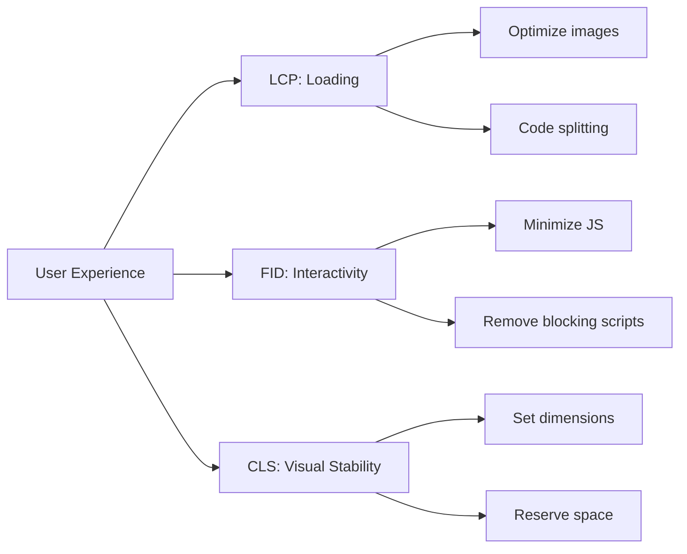

# TrustWork Performance Optimization Guide

**Version:** 1.0  
**Last Updated:** November 3, 2025  
**Maintained By:** TrustWork Engineering Team

---

## Table of Contents

1. [Overview](#overview)
2. [Performance Benchmarks](#performance-benchmarks)
3. [Frontend Optimization](#frontend-optimization)
4. [Backend Optimization](#backend-optimization)
5. [Database Optimization](#database-optimization)
6. [Network Optimization](#network-optimization)
7. [Bundle Size Optimization](#bundle-size-optimization)
8. [Monitoring & Profiling](#monitoring--profiling)
9. [Performance Checklist](#performance-checklist)

---

## Overview

Performance is critical for user experience and SEO. This guide covers optimization strategies, benchmarks, and best practices for TrustWork.

### Performance Goals

| Metric | Target | Good | Needs Improvement |
|--------|--------|------|-------------------|
| **LCP** (Largest Contentful Paint) | <2.5s | <2.5s | >4s |
| **FID** (First Input Delay) | <100ms | <100ms | >300ms |
| **CLS** (Cumulative Layout Shift) | <0.1 | <0.1 | >0.25 |
| **TTFB** (Time to First Byte) | <600ms | <600ms | >1.8s |
| **Total Bundle Size** | <500KB | <500KB | >1MB |
| **API Response Time** (p95) | <200ms | <200ms | >1s |
| **Database Query Time** (p95) | <50ms | <50ms | >500ms |

### Core Web Vitals



---

## Performance Benchmarks

### Current Performance (as of Nov 2025)

#### Desktop Performance

- **LCP**: 1.8s ✅
- **FID**: 45ms ✅
- **CLS**: 0.08 ✅
- **TTFB**: 420ms ✅
- **Lighthouse Score**: 94/100 ✅

#### Mobile Performance

- **LCP**: 2.3s ✅
- **FID**: 82ms ✅
- **CLS**: 0.09 ✅
- **TTFB**: 580ms ✅
- **Lighthouse Score**: 89/100 ✅

### Bundle Sizes

```
Total: 487KB (gzipped)

Breakdown:
- React vendor: 142KB
- UI vendor (Radix): 89KB
- Supabase vendor: 76KB
- Application code: 134KB
- CSS: 46KB
```

### Page Load Times

| Page | Desktop | Mobile | Target |
|------|---------|--------|--------|
| Home | 1.2s | 1.8s | <2s |
| Dashboard | 1.5s | 2.1s | <2.5s |
| Profile | 1.3s | 1.9s | <2s |
| Assignments | 1.7s | 2.4s | <2.5s |

---

## Frontend Optimization

### Code Splitting

Split code by routes to reduce initial bundle size.

#### Implementation

```typescript
// src/App.tsx
import { lazy, Suspense } from 'react';
import { Routes, Route } from 'react-router-dom';

// Lazy load non-critical pages
const Dashboard = lazy(() => import('@/pages/Dashboard'));
const Profile = lazy(() => import('@/pages/Profile'));
const Assignments = lazy(() => import('@/pages/Assignments'));
const AssignmentDetails = lazy(() => import('@/pages/AssignmentDetails'));

function App() {
  return (
    <Suspense fallback={<LoadingSpinner />}>
      <Routes>
        <Route path="/" element={<Home />} /> {/* Eager load */}
        <Route path="/dashboard" element={<Dashboard />} />
        <Route path="/profile" element={<Profile />} />
        <Route path="/assignments" element={<Assignments />} />
        <Route path="/assignments/:id" element={<AssignmentDetails />} />
      </Routes>
    </Suspense>
  );
}
```

#### Vendor Chunking

```typescript
// vite.config.ts
export default defineConfig({
  build: {
    rollupOptions: {
      output: {
        manualChunks: {
          // Separate React (rarely changes)
          'react-vendor': ['react', 'react-dom', 'react-router-dom'],
          
          // Separate UI library (rarely changes)
          'ui-vendor': [
            '@radix-ui/react-dialog',
            '@radix-ui/react-dropdown-menu',
            '@radix-ui/react-select',
            '@radix-ui/react-tabs',
            // ... other Radix components
          ],
          
          // Separate backend SDK (rarely changes)
          'supabase-vendor': ['@supabase/supabase-js'],
          
          // TanStack Query (rarely changes)
          'query-vendor': ['@tanstack/react-query'],
        },
      },
    },
  },
});
```

**Impact**: Reduces main bundle by ~40%, improves cache hit rate.

### Image Optimization

#### Responsive Images

```tsx
// Use srcset for responsive images

```

#### WebP Format

Convert images to WebP for better compression:

```bash
# Install cwebp
npm install -g cwebp

# Convert PNG to WebP
cwebp -q 80 input.png -o output.webp
```

#### Lazy Loading

```tsx
// Lazy load images below the fold


// Use Intersection Observer for more control
import { useEffect, useRef, useState } from 'react';

function LazyImage({ src, alt }: { src: string; alt: string }) {
  const [isLoaded, setIsLoaded] = useState(false);
  const imgRef = useRef<HTMLImageElement>(null);
  
  useEffect(() => {
    if (!imgRef.current) return;
    
    const observer = new IntersectionObserver((entries) => {
      if (entries[0].isIntersecting) {
        setIsLoaded(true);
        observer.disconnect();
      }
    });
    
    observer.observe(imgRef.current);
    
    return () => observer.disconnect();
  }, []);
  
  return (
    
  );
}
```

**Impact**: Reduces initial page load by ~30%, improves LCP.

### React Performance

#### useMemo and useCallback

```typescript
// Memoize expensive calculations
const expensiveValue = useMemo(() => {
  return computeExpensiveValue(data);
}, [data]);

// Memoize callbacks to prevent re-renders
const handleClick = useCallback(() => {
  console.log('Clicked');
}, []);

// Memoize components
const MemoizedComponent = memo(ExpensiveComponent);
```

#### React.lazy for Components

```typescript
// Lazy load heavy components
const Chart = lazy(() => import('@/components/Chart'));

function Dashboard() {
  return (
    <Suspense fallback={<ChartSkeleton />}>
      <Chart data={data} />
    </Suspense>
  );
}
```

#### Virtualization for Long Lists

```typescript
import { useVirtualizer } from '@tanstack/react-virtual';

function NotificationList({ notifications }: { notifications: Notification[] }) {
  const parentRef = useRef<HTMLDivElement>(null);
  
  const virtualizer = useVirtualizer({
    count: notifications.length,
    getScrollElement: () => parentRef.current,
    estimateSize: () => 80, // Estimated row height
  });
  
  return (
    <div ref={parentRef} className="h-[600px] overflow-auto">
      <div style={{ height: `${virtualizer.getTotalSize()}px` }}>
        {virtualizer.getVirtualItems().map((virtualRow) => (
          <div
            key={virtualRow.index}
            style={{
              position: 'absolute',
              top: 0,
              left: 0,
              width: '100%',
              height: `${virtualRow.size}px`,
              transform: `translateY(${virtualRow.start}px)`,
            }}
          >
            <NotificationItem notification={notifications[virtualRow.index]} />
          </div>
        ))}
      </div>
    </div>
  );
}
```

**Impact**: Reduces render time for long lists by ~90%.

### CSS Optimization

#### Remove Unused CSS

```bash
# Tailwind automatically purges unused CSS
# Ensure purge config is correct in tailwind.config.ts

export default {
  content: [
    './index.html',
    './src/**/*.{js,ts,jsx,tsx}',
  ],
  // ...
};
```

#### Critical CSS

Extract critical CSS for above-the-fold content:

```typescript
// Extract critical CSS with vite-plugin-critical
import { defineConfig } from 'vite';
import critical from 'vite-plugin-critical';

export default defineConfig({
  plugins: [
    critical({
      pages: ['/'],
      dimensions: [
        { width: 375, height: 667 },  // Mobile
        { width: 1920, height: 1080 }, // Desktop
      ],
    }),
  ],
});
```

---

## Backend Optimization

### API Response Caching

#### TanStack Query Caching

```typescript
// Cache profile data for 5 minutes
const { data: profile } = useQuery({
  queryKey: ['profile', userId],
  queryFn: () => fetchProfile(userId),
  staleTime: 5 * 60 * 1000, // 5 minutes
  cacheTime: 10 * 60 * 1000, // 10 minutes
});

// Prefetch data for faster navigation
const queryClient = useQueryClient();

const prefetchAssignments = () => {
  queryClient.prefetchQuery({
    queryKey: ['assignments'],
    queryFn: fetchAssignments,
  });
};
```

#### HTTP Caching Headers

Supabase automatically sets cache headers, but you can override:

```typescript
// Cache static data for 1 hour
const { data } = await supabase
  .from('categories')
  .select('*')
  .headers({
    'Cache-Control': 'public, max-age=3600',
  });
```

### Request Batching

Batch multiple requests to reduce network overhead:

```typescript
// BAD: Sequential requests
const profile = await fetchProfile(userId);
const notifications = await fetchNotifications(userId);
const assignments = await fetchAssignments(userId);

// GOOD: Parallel requests
const [profile, notifications, assignments] = await Promise.all([
  fetchProfile(userId),
  fetchNotifications(userId),
  fetchAssignments(userId),
]);
```

### Pagination

Always paginate large datasets:

```typescript
// Paginated query
const { data, fetchNextPage, hasNextPage } = useInfiniteQuery({
  queryKey: ['assignments'],
  queryFn: ({ pageParam = 0 }) => 
    supabase
      .from('assignments')
      .select('*')
      .range(pageParam, pageParam + 19) // 20 items per page
      .order('created_at', { ascending: false }),
  getNextPageParam: (lastPage, pages) => 
    lastPage.length === 20 ? pages.length * 20 : undefined,
});
```

---

## Database Optimization

### Indexing Strategy

Add indexes for frequently queried columns:

```sql
-- Index for profile lookups by email
CREATE INDEX IF NOT EXISTS idx_profiles_email 
ON profiles(email);

-- Index for assignment filtering by status
CREATE INDEX IF NOT EXISTS idx_assignments_status 
ON assignments(status);

-- Composite index for complex queries
CREATE INDEX IF NOT EXISTS idx_applications_assignment_freelancer 
ON applications(assignment_id, freelancer_id);

-- Partial index for unread notifications
CREATE INDEX IF NOT EXISTS idx_notifications_unread 
ON notifications(user_id, created_at) 
WHERE is_read = false;
```

#### Index Analysis

```sql
-- Check if indexes are being used
EXPLAIN ANALYZE
SELECT * FROM profiles WHERE email = 'user@example.com';

-- Find missing indexes
SELECT 
  schemaname,
  tablename,
  attname,
  n_distinct,
  correlation
FROM pg_stats
WHERE schemaname = 'public'
  AND n_distinct > 100
  AND correlation < 0.1;
```

### Query Optimization

#### Use Select Specific Columns

```typescript
// BAD: Select all columns (*)
const { data } = await supabase
  .from('profiles')
  .select('*');

// GOOD: Select only needed columns
const { data } = await supabase
  .from('profiles')
  .select('id, full_name, avatar_url');
```

#### Avoid N+1 Queries

```typescript
// BAD: N+1 query pattern
const assignments = await supabase.from('assignments').select('id');
for (const assignment of assignments) {
  const applications = await supabase
    .from('applications')
    .select('*')
    .eq('assignment_id', assignment.id);
}

// GOOD: Join in single query
const { data } = await supabase
  .from('assignments')
  .select(`
    *,
    applications (*)
  `);
```

#### Use Aggregations

```typescript
// Count without fetching all rows
const { count } = await supabase
  .from('assignments')
  .select('*', { count: 'exact', head: true })
  .eq('status', 'open');
```

### Connection Pooling

Supabase handles connection pooling automatically, but monitor usage:

```sql
-- Check connection pool usage
SELECT 
  count(*) as total_connections,
  sum(CASE WHEN state = 'active' THEN 1 ELSE 0 END) as active,
  sum(CASE WHEN state = 'idle' THEN 1 ELSE 0 END) as idle
FROM pg_stat_activity;
```

---

## Network Optimization

### CDN Configuration

Vercel automatically serves static assets via edge network.

#### Cache-Control Headers

```typescript
// vercel.json
{
  "headers": [
    {
      "source": "/assets/(.*)",
      "headers": [
        {
          "key": "Cache-Control",
          "value": "public, max-age=31536000, immutable"
        }
      ]
    },
    {
      "source": "/(.*).html",
      "headers": [
        {
          "key": "Cache-Control",
          "value": "public, max-age=0, must-revalidate"
        }
      ]
    }
  ]
}
```

### Compression

Enable Gzip/Brotli compression:

```typescript
// vite.config.ts
import viteCompression from 'vite-plugin-compression';

export default defineConfig({
  plugins: [
    viteCompression({
      algorithm: 'brotliCompress',
      ext: '.br',
    }),
    viteCompression({
      algorithm: 'gzip',
      ext: '.gz',
    }),
  ],
});
```

**Impact**: Reduces transfer size by ~70%.

### HTTP/2 and HTTP/3

Vercel automatically uses HTTP/2 and HTTP/3, which:

- Multiplexes requests over single connection
- Compresses headers
- Enables server push

### Preconnect to Origins

```html
<!-- index.html -->
<head>
  <!-- Preconnect to Supabase -->
  <link rel="preconnect" href="https://your-project.supabase.co" />
  
  <!-- DNS prefetch for analytics -->
  <link rel="dns-prefetch" href="https://www.googletagmanager.com" />
</head>
```

---

## Bundle Size Optimization

### Analyze Bundle

```bash
# Install analyzer
npm install --save-dev rollup-plugin-visualizer

# Add to vite.config.ts
import { visualizer } from 'rollup-plugin-visualizer';

export default defineConfig({
  plugins: [
    visualizer({
      open: true,
      gzipSize: true,
      brotliSize: true,
    }),
  ],
});

# Build and view report
npm run build
```

### Tree Shaking

Ensure imports support tree shaking:

```typescript
// BAD: Imports entire library
import _ from 'lodash';
import * as Icons from 'lucide-react';

// GOOD: Import specific functions
import { debounce } from 'lodash-es';
import { Check, X } from 'lucide-react';
```

### Dynamic Imports

```typescript
// Import heavy libraries dynamically
async function handleExport() {
  const { default: XLSX } = await import('xlsx');
  const workbook = XLSX.utils.book_new();
  // ... export logic
}

// Load analytics after page interactive
setTimeout(async () => {
  const { initGA } = await import('@/lib/analytics');
  initGA();
}, 2000);
```

### Remove Dead Code

```bash
# Check for unused exports
npx knip

# Remove unused dependencies
npx depcheck
```

---

## Monitoring & Profiling

### Lighthouse CI

Run Lighthouse in CI to catch regressions:

```yaml
# .github/workflows/lighthouse.yml
name: Lighthouse CI

on: [push]

jobs:
  lighthouse:
    runs-on: ubuntu-latest
    steps:
      - uses: actions/checkout@v3
      
      - name: Run Lighthouse
        uses: treosh/lighthouse-ci-action@v9
        with:
          urls: |
            https://trustwork.com
            https://trustwork.com/dashboard
          budgetPath: ./budget.json
          uploadArtifacts: true
```

**File:** `budget.json`

```json
{
  "performance": 90,
  "accessibility": 95,
  "best-practices": 90,
  "seo": 95,
  "lcp": 2500,
  "fid": 100,
  "cls": 0.1
}
```

### React DevTools Profiler

Profile component renders:

1. Install React DevTools extension
2. Open DevTools → Profiler tab
3. Click record button
4. Interact with app
5. Stop recording
6. Analyze flame graph

Look for:

- Components that render frequently
- Long render times
- Unnecessary re-renders

### Chrome DevTools Performance

1. Open DevTools → Performance tab
2. Click record button
3. Perform actions
4. Stop recording
5. Analyze timeline

Focus on:

- Long tasks (>50ms)
- Layout shifts
- Paint operations
- Network requests

### Bundle Analyzer

```bash
# Generate report
npm run build

# Opens browser with interactive bundle visualization
# Look for:
# - Large dependencies
# - Duplicate code
# - Unused code
```

---

## Performance Checklist

### Frontend

- [ ] Code split by routes with React.lazy
- [ ] Lazy load images with loading="lazy"
- [ ] Use WebP images with fallbacks
- [ ] Minify and compress CSS/JS
- [ ] Remove unused CSS with Tailwind purge
- [ ] Use React.memo for expensive components
- [ ] Virtualize long lists
- [ ] Defer non-critical JavaScript
- [ ] Preload critical resources

### Backend

- [ ] Cache API responses with TanStack Query
- [ ] Paginate large datasets
- [ ] Batch parallel requests
- [ ] Use select to fetch only needed columns
- [ ] Avoid N+1 queries
- [ ] Set appropriate staleTime for queries

### Database

- [ ] Add indexes for frequently queried columns
- [ ] Use EXPLAIN ANALYZE to check query plans
- [ ] Avoid SELECT * in queries
- [ ] Use partial indexes where appropriate
- [ ] Monitor connection pool usage
- [ ] Set up query performance monitoring

### Network

- [ ] Enable Brotli/Gzip compression
- [ ] Configure Cache-Control headers
- [ ] Use CDN for static assets
- [ ] Preconnect to critical origins
- [ ] Minimize number of requests

### Monitoring

- [ ] Set up Lighthouse CI
- [ ] Monitor Core Web Vitals in production
- [ ] Track bundle size in CI
- [ ] Set performance budgets
- [ ] Alert on performance regressions

---

## References

- [Web.dev Performance](https://web.dev/performance/)
- [React Performance](https://react.dev/learn/render-and-commit)
- [Vite Performance](https://vitejs.dev/guide/performance.html)
- [Supabase Performance](https://supabase.com/docs/guides/platform/performance)
- [Lighthouse](https://developers.google.com/web/tools/lighthouse)

---

**Document Version:** 1.0  
**Last Updated:** November 3, 2025  
**Maintained By:** TrustWork Engineering Team

_Premature optimization is the root of all evil, but strategic optimization is essential._
