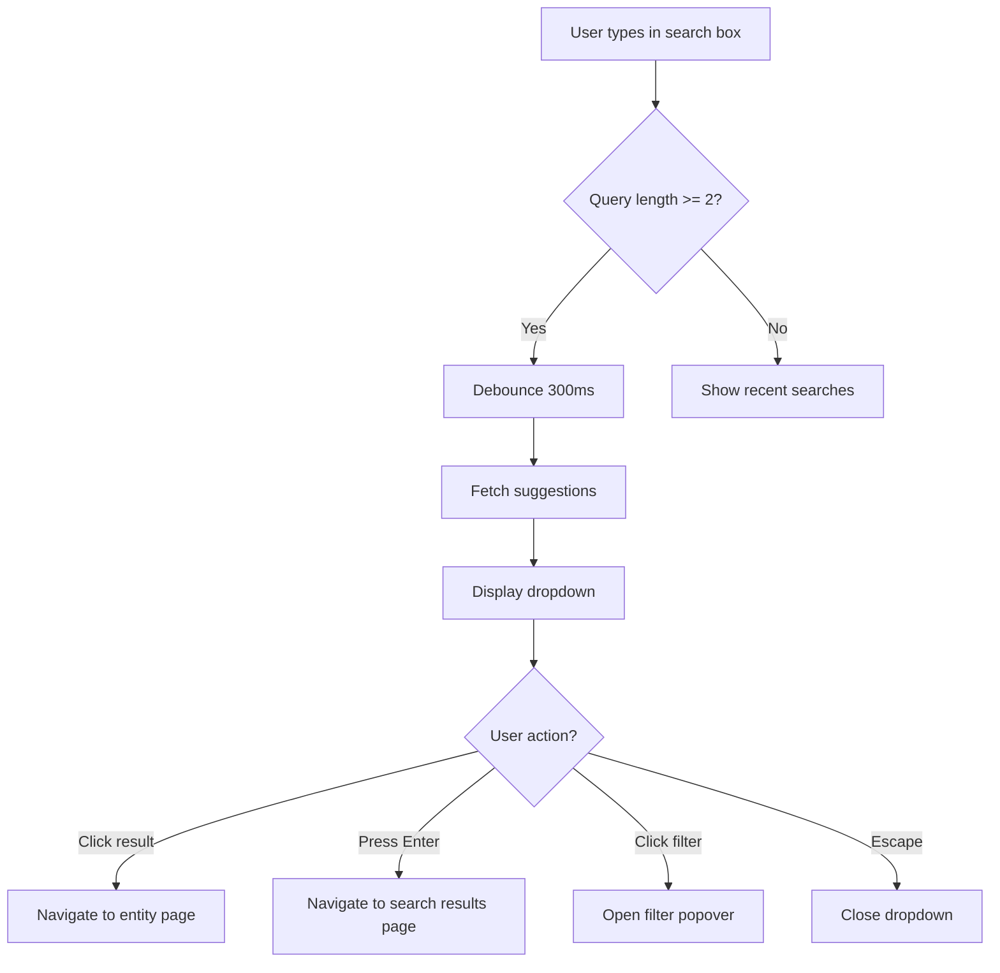

# Universal Search System

## Overview

The TrustWork platform now features a **single, consolidated universal search component** (`InlineSearch`) that provides search functionality across all entity types (assignments, freelancers, companies, and skills).

## Problem Solved

Previously, the application had **three separate search components** with overlapping functionality:

1. `InlineSearch.tsx` - Used in top navigation with autocomplete
2. `SearchBar.tsx` - Advanced search with filters and keyboard shortcuts
3. `search-bar.tsx` - Basic search with command-based filters

This duplication caused:

- Inconsistent UX across the platform
- Maintenance overhead (updates needed in 3 places)
- Code bloat and confusion
- Different filter structures and behaviors

## Solution

**Consolidated into ONE component** (`InlineSearch`) that combines the best features from all three:

### ✅ Features from Original InlineSearch

- Debounced search input (300ms delay)
- Autocomplete suggestions dropdown
- Click-outside-to-close behavior
- Search result navigation by type

### ✅ Features from SearchBar

- Keyboard shortcuts (Cmd/Ctrl + K to focus)
- Filter button with active count badge
- Size variants (sm, md, lg)
- Active filter preview badges

### ✅ Features from search-bar

- Command-based filter selection (TODO: Advanced filters)
- Filter icons and visual indicators
- Common filter presets

### ✅ New Features

- **Recent searches history** stored in localStorage
- Recent searches dropdown when focused (empty query)
- Better loading states with spinner
- Improved accessibility (ARIA labels, keyboard navigation)
- Filter state management
- Responsive design with mobile optimizations

## Component API

```tsx
import { InlineSearch } from '@/components/search/InlineSearch';

// Basic uncontrolled usage (most common)
<InlineSearch placeholder="Search..." />

// Controlled with filters
<InlineSearch 
  value={searchQuery}
  onChange={setSearchQuery}
  filters={filters}
  onFiltersChange={setFilters}
  showFilters={true}
/>

// Custom sizing
<InlineSearch size="lg" />

// With callbacks
<InlineSearch 
  onSearch={(query) => console.log('Searching:', query)}
  autoFocus
/>
```

## Props Reference

| Prop | Type | Default | Description |
|------|------|---------|-------------|
| `value` | `string` | undefined | Controlled search query |
| `onChange` | `(value: string) => void` | undefined | Called when query changes |
| `category` | `SearchCategory` | `'all'` | Filter by category (all, assignments, freelancers, companies, skills) |
| `filters` | `SearchFilters` | undefined | Active search filters object |
| `onFiltersChange` | `(filters: SearchFilters) => void` | undefined | Called when filters change |
| `onSearch` | `(query: string) => void` | undefined | Called when search is executed (Enter key or button click) |
| `placeholder` | `string` | "Search assignments..." | Input placeholder text |
| `showFilters` | `boolean` | `true` | Show filter button |
| `showSuggestions` | `boolean` | `true` | Show autocomplete dropdown |
| `size` | `'sm' \| 'md' \| 'lg'` | `'md'` | Component size |
| `className` | `string` | `''` | Additional CSS classes |
| `autoFocus` | `boolean` | `false` | Auto-focus input on mount |

## Search Flow



## Keyboard Shortcuts

| Shortcut | Action |
|----------|--------|
| `Cmd/Ctrl + K` | Focus search input from anywhere |
| `Enter` | Execute search (navigate to results page) |
| `Escape` | Close dropdown / blur input |

## Recent Searches

- Automatically saved to `localStorage` when searches are executed
- Maximum 5 recent searches stored
- Displayed when input is focused with empty or short query
- Click to re-execute previous search
- Persists across browser sessions

## Search Results Dropdown

Shows real-time suggestions grouped by type:

### When query is empty or < 2 characters

- **Recent Searches** section with last 5 searches
- Click to quickly re-run a search

### When query >= 2 characters

- **Search Results** grouped by entity type
- Each result shows:
  - Icon/avatar based on type
  - Title and subtitle
  - Brief description
  - Metadata (budget, location, rating, skills)
  - Type badge (Assignment, Freelancer, Company, Skill)

### When no results found

- Empty state with search icon
- "Search all results" link to full search page

## Filter Support

The component supports comprehensive filtering through the `SearchFilters` interface:

```typescript
interface SearchFilters {
  // Location
  location?: string;
  province?: string;
  remote?: boolean;
  
  // Budget & compensation
  budgetMin?: number;
  budgetMax?: number;
  paymentType?: 'fixed' | 'hourly';
  
  // Skills & experience
  skills?: string[];
  experienceLevel?: 'entry' | 'intermediate' | 'senior' | 'expert';
  
  // Industry & categories
  industry?: string;
  category?: string;
  
  // Job details
  jobType?: 'full-time' | 'part-time' | 'contract' | 'freelance';
  duration?: string;
  
  // User filters
  rating?: number;
  verified?: boolean;
  certifications?: string[];
}
```

### Filter Display

- Active filters shown as badges below search input
- Filter button shows count badge (e.g., "3 filters active")
- Visual preview of applied filters (location, skills count, budget, industry)

## Integration Points

### Current Usage

- **TopNavigation** - Primary search in navbar (always visible)
- Can be added to any page that needs search functionality

### Navigation Routes

After search execution, users are redirected to:

- `/search?q={query}&category={category}&...filters` - Main search results page
- `/assignments/{id}` - When clicking assignment result
- `/profile/{id}` - When clicking freelancer result  
- `/company/{id}` - When clicking company result
- Skill searches redirect to assignment search filtered by that skill

## Backend Integration (TODO)

Currently uses **mock data**. To integrate with Supabase:

### 1. Create Supabase Function

```sql
CREATE OR REPLACE FUNCTION universal_search(
  search_query TEXT,
  search_category TEXT DEFAULT 'all',
  filters JSONB DEFAULT '{}'::jsonb,
  result_limit INT DEFAULT 10
)
RETURNS JSONB AS $$
DECLARE
  results JSONB;
BEGIN
  -- Full-text search across assignments, profiles, companies, skills
  -- Use pg_trgm for fuzzy matching
  -- Apply filters from JSONB parameter
  -- Return structured results by type
  
  RETURN results;
END;
$$ LANGUAGE plpgsql SECURITY DEFINER;
```

### 2. Replace Mock Data in Component

In `InlineSearch.tsx`, replace the mock data section with:

```typescript
// Inside performSearchLocal in useEffect
const { data, error } = await supabase
  .rpc('universal_search', { 
    search_query: debouncedQuery,
    search_category: category,
    filters: filters,
    result_limit: 10
  });

if (error) throw error;
setResults(data || []);
```

### 3. Add Database Indexes

For optimal search performance:

```sql
-- Full-text search indexes
CREATE INDEX idx_assignments_search ON assignments 
  USING GIN (to_tsvector('english', title || ' ' || description));

CREATE INDEX idx_profiles_search ON profiles 
  USING GIN (to_tsvector('english', full_name || ' ' || title || ' ' || bio));

-- Trigram indexes for fuzzy matching
CREATE EXTENSION IF NOT EXISTS pg_trgm;

CREATE INDEX idx_assignments_title_trgm ON assignments 
  USING GIN (title gin_trgm_ops);

CREATE INDEX idx_profiles_name_trgm ON profiles 
  USING GIN (full_name gin_trgm_ops);

-- Skills array search
CREATE INDEX idx_profiles_skills ON profiles USING GIN (skills);
```

## Performance Considerations

### Debouncing

- **300ms delay** prevents excessive API calls
- Balances responsiveness with server load
- User doesn't notice the delay due to instant input feedback

### Lazy Loading

- Dropdown results limited to 10 per category (configurable)
- "View all results" link for comprehensive search
- Prevents overwhelming UI with too many results

### Caching (Future Enhancement)

Consider implementing:

- Query result caching in memory (React Query)
- Service worker for offline search of recent/popular items
- CDN caching for frequently searched terms

## Accessibility

- **ARIA labels** on all interactive elements
- **Keyboard navigation** fully supported
- **Screen reader friendly** result announcements
- **Focus management** (auto-focus options, blur on close)
- **High contrast** mode compatible

## Mobile Considerations

- Responsive layout collapses appropriately
- Touch-friendly target sizes (48px minimum)
- Keyboard shortcut hint hidden on small screens
- Dropdown scrolls independently on mobile
- Virtual keyboard doesn't obscure results

## Testing

### Unit Tests (TODO)

```typescript
describe('InlineSearch', () => {
  it('shows recent searches when focused with empty query', () => {});
  it('debounces search input by 300ms', () => {});
  it('displays filter count badge when filters active', () => {});
  it('navigates to correct page on result click', () => {});
  it('saves search to recent searches on Enter', () => {});
  it('supports keyboard shortcuts (Cmd+K, Enter, Escape)', () => {});
  it('closes dropdown when clicking outside', () => {});
});
```

### Manual Testing Checklist

- [ ] Search input focuses with Cmd/Ctrl + K
- [ ] Recent searches appear when focused (empty query)
- [ ] Suggestions appear after 2 characters
- [ ] Loading spinner shows during API call
- [ ] Results grouped correctly by type
- [ ] Clicking result navigates to correct page
- [ ] Enter key navigates to search results page
- [ ] Escape closes dropdown
- [ ] Clear button (X) works
- [ ] Filter button shows count badge
- [ ] Active filters display as badges
- [ ] Mobile layout works correctly
- [ ] Keyboard navigation works
- [ ] Click outside closes dropdown
- [ ] Recent searches persist across sessions

## Migration Notes

### Files Removed ✅

- `src/components/search/SearchBar.tsx` (advanced search variant)
- `src/components/ui/search-bar.tsx` (basic search variant)

### Files Modified ✅

- `src/components/search/InlineSearch.tsx` (enhanced with all features)

### Breaking Changes

None - `InlineSearch` was already exported and used in `TopNavigation`. The API is backward compatible.

### Imports to Update

If any code was importing the deleted components:

```typescript
// Old (REMOVED)
import SearchBar from '@/components/search/SearchBar';
import { SearchBar } from '@/components/ui/search-bar';

// New (USE THIS)
import { InlineSearch } from '@/components/search/InlineSearch';
```

## Future Enhancements

### Phase 2 (Next Sprint)

- [ ] Implement full filter UI in popover (currently placeholder)
- [ ] Add search result type tabs (All, Assignments, Freelancers, etc.)
- [ ] Voice search support
- [ ] Search analytics tracking
- [ ] Personalized search suggestions

### Phase 3 (Later)

- [ ] Advanced query syntax (e.g., "React AND (remote OR Johannesburg)")
- [ ] Saved searches with email alerts
- [ ] Search history page (view/manage all past searches)
- [ ] Search result preview on hover
- [ ] AI-powered search refinement suggestions

## Related Documentation

- [Search Types Reference](../src/types/search.ts) - TypeScript interfaces
- [Component Library](./COMPONENT_LIBRARY.md) - UI components used
- [Architecture](./ARCHITECTURE.md) - Overall system design
- [API Documentation](./API.md) - Backend integration guide

## Support

For questions or issues with the Universal Search:

1. Check the TypeScript types in `src/types/search.ts`
2. Review the component source in `src/components/search/InlineSearch.tsx`
3. Test with mock data before implementing real API
4. Ensure Supabase function is properly secured with RLS policies

---

**Last Updated:** 2025-01-24  
**Status:** ✅ Consolidated, 📝 API Integration Pending  
**Contributors:** AI Coding Agent
